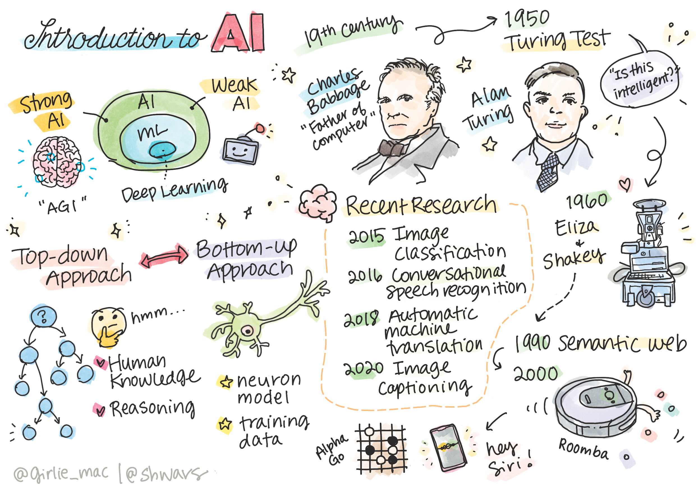
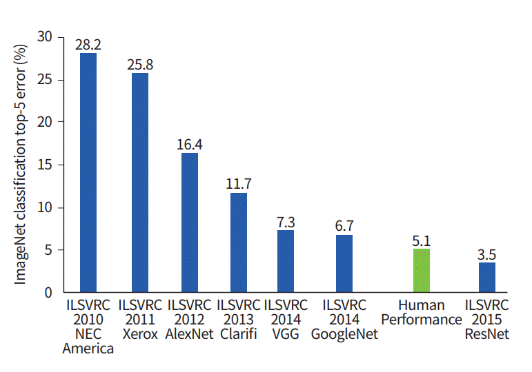

# 人工智能简介

> 涂鸦笔记由 [Tomomi Imura](https://twitter.com/girlie_mac) 提供

## [课前测验](https://red-field-0a6ddfd03.1.azurestaticapps.net/quiz/101)

**人工智能** 是一门令人兴奋的科学学科，研究如何使计算机表现出智能行为，例如执行人类擅长的任务。

最初，计算机由 [查尔斯·巴贝奇](https://en.wikipedia.org/wiki/Charles_Babbage) 发明，用于按照预定的步骤——算法，对数字进行操作。现代计算机虽然比19世纪提出的原型机更为先进，但仍遵循相同的受控计算思想。因此，如果我们知道达到目标的确切步骤，就可以编程使计算机执行某个任务。

> 照片由 [Vickie Soshnikova](http://twitter.com/vickievalerie) 提供

> ✅ 从照片中识别人的年龄是一项无法明确编程的任务，因为我们不知道我们在脑海中得出数字的具体过程。

---

然而，有些任务是我们无法明确解决的。考虑一下如何从一个人的照片中确定他的年龄。我们通过观察不同年龄的人的很多实例学会这一技能，但我们无法明确解释是如何做到的，更无法编程实现。这正是 **人工智能** (简写为AI) 感兴趣的任务。

✅ 请想想有哪些任务可以通过AI交给计算机完成。考虑金融、医疗和艺术领域——这些领域今天如何从AI中受益？

## 弱人工智能与强人工智能

弱人工智能 | 强人工智能
---------------------------------------|-------------------------------------
弱人工智能是指为特定任务或狭窄任务设计和训练的AI系统。|强人工智能，又称人工通用智能 (AGI)，指的是具有人类智能和理解能力的AI系统。
这些AI系统通常不具备通用智能；它们在执行预定义的任务上表现出色，但缺乏真正的理解或意识。|这些AI系统具备执行任何人类可以执行的智力任务的能力，可以适应不同领域，并具有某种形式的意识或自我认知。
弱人工智能的例子包括Siri或Alexa这类虚拟助手、流媒体服务中的推荐算法，以及专门为客户服务任务设计的聊天机器人。|实现强人工智能是AI研究的长期目标，需要开发能够在各种任务和背景下进行推理、学习、理解和适应的AI系统。
弱人工智能高度专业化，不具备超出其狭窄领域的人类认知能力或通用问题解决能力。|强人工智能目前仍是一个理论概念，还没有AI系统达到这种通用智能水平。

有关更多信息，请参阅 **[人工通用智能](https://en.wikipedia.org/wiki/Artificial_general_intelligence)** (AGI)。
## 智力定义与图灵测试

处理 **[智力](https://en.wikipedia.org/wiki/Intelligence)** 术语时，其中一个问题是没有明确的定义。可以说智力与 **抽象思维** 或 **自我意识** 相关，但我们无法准确定义它。

> [照片](https://unsplash.com/photos/75715CVEJhI) 由 [Amber Kipp](https://unsplash.com/@sadmax) 提供，来自Unsplash

为了看到“智力”这一术语的模糊性，试回答这个问题：“猫是智能的吗？”不同的人往往对此给出不同答案，因为没有普遍接受的测试能证明这一断言是真或假的。如果你认为有——那就试着让你的猫通过智商测试吧...

✅ 花一分钟思考一下你如何定义智力。一只可以解迷宫取得食物的乌鸦智能吗？一个孩子聪明吗？

---

在谈论AGI时，我们需要一种方法来判断我们是否创建了真正的智能系统。[艾伦·图灵](https://en.wikipedia.org/wiki/Alan_Turing) 提出了一种方法，称为 **[图灵测试](https://en.wikipedia.org/wiki/Turing_test)**，这也像是对智力的定义。该测试将给定系统与内在智能——真实人类进行比较，因为任何自动比较都可能被计算机程序绕过，所以我们使用人工审讯者。因此，如果一个人无法区分真实的人与计算机系统在基于文本的对话中的区别——该系统就被认为是智能的。

> 一个名为 [Eugene Goostman](https://en.wikipedia.org/wiki/Eugene_Goostman) 的聊天机器人于2014年在圣彼得堡接近通过图灵测试，采用了一种聪明的性格诡计。它提前宣布自己是一个13岁的乌克兰男孩，这解释了知识缺乏和文本中的一些差异。这位机器人在5分钟的对话中说服30%的评委认为它是人类，图灵相信机器到2000年可以通过这一指标。然而，需要理解的是，这并不表示我们创造了智能系统，或计算机系统欺骗了人类审讯者——系统并没有欺骗真人，而是机器人的创造者掌握了技巧！

✅ 你是否曾被一个聊天机器人欺骗，认为你在和人类说话？它是如何让你相信的？

## 人工智能的不同方法

如果我们希望计算机像人类一样行动，我们需要某种方式在计算机内部建模我们的思维方式。因此，我们需要尝试理解是什么让人类聪明。

> 要能将智能编程到机器中，我们需要理解自己的决策过程。如果进行自我内省，你会意识到有些过程是下意识发生的——例如，我们可以不加思索地分辨出猫和狗——而有些过程则涉及推理。

解决这一问题有两种可能的方法：

自上而下方法（符号推理） | 自下而上方法（神经网络）
-----------------------------------|-----------------------------------------
自上而下的方法模拟人类解决问题的推理方式。 它包括从人类中提取 **知识**，并将其表示为计算机可读的形式。 我们还需要开发一种在计算机内部建模 **推理** 的方法。|自下而上方法模拟人脑的结构，包括大量称为 **神经元** 的简单单元。 每个神经元的作用类似于其输入的加权平均值，并且通过提供 **训练数据**，我们可以训练神经元网络来解决有用的问题。

此外，还有其他一些可能的智能方法：

* **涌现**、**协同**或 **多代理方法** 基于这样一个事实，即通过大量简单代理之间的相互作用可以获得复杂的智能行为。根据 [进化控制论](https://en.wikipedia.org/wiki/Global_brain#Evolutionary_cybernetics)，智能可以通过在 *元系统过渡* 过程中更简单的反应行为 *涌现* 出来。

* **进化方法**，或 **遗传算法** 是一种基于进化原理的优化过程。

我们将在课程后续考虑这些方法，但目前我们将重点关注两种主要方向：自上而下和自下而上。

### 自上而下方法

在 **自上而下方法** 中，我们尝试模型化我们的推理。因为我们可以在推理时跟踪我们的思维，尝试将这一过程形式化并编程到计算机中。这被称为 **符号推理**。

人们倾向于在脑海中有一些指导决策过程的规则。例如，当医生诊断患者时，可能会意识到人有发烧症状，因此体内可能有一些炎症。通过将大量规则应用于具体问题，医生可能能够得出最终诊断。

这种方法严重依赖 **知识表示** 和 **推理**。从人类专家提取知识可能是最困难的部分，因为许多情况下医生自己都不知道为何得出了特定诊断。有时解决方案在他的脑海中自动形成而无需明确思考。一些任务，例如从照片中确定一个人的年龄，完全无法通过操作知识来进行。

### 自下而上方法

或者，我们可以尝试对大脑中的最简单元素——神经元进行建模。我们可以在计算机中构建一个所谓的 **人工神经网络**，然后尝试通过提供示例来教它解决问题。这一过程类似于一个新生儿通过观察周围环境学习的方法。

✅ 做一些关于婴儿如何学习的研究。婴儿大脑的基本元素是什么？

> | 关于机器学习呢？ | |
> |------------------------------|-----------|
> | 基于计算机学习以解决问题的一部分人工智能被称为 **机器学习**。 我们在本课程中不会考虑传统机器学习——请参阅单独的 [初学者的机器学习](http://aka.ms/ml-beginners) 课程。 |  |

## 人工智能简史

人工智能作为一个领域始于20世纪中期。最初，符号推理是一种普遍的方法，并取得了一些重要的成功，如专家系统——能够在有限问题领域内充当专家的计算机程序。然而，很快就显露出这种方法的局限性。将知识从专家提取出来，在计算机中表示出来，并保持知识库的准确性，结果发现这是一个非常复杂的任务，并且在很多情况下成本过高而不实际。这导致了1970年代的所谓 [AI冬天](https://en.wikipedia.org/wiki/AI_winter)。

> 图片由 [Dmitry Soshnikov](http://soshnikov.com) 提供

随着时间的推移，计算资源变得更加便宜，且可以获得更多数据，因此神经网络方法在计算机视觉或语音理解等许多领域中表现出卓越的性能。在过去的十年中，人工智能这个术语大多作为神经网络的同义词出现，因为我们听到的大多数AI成功都基于神经网络。

我们可以观察到，在创建象棋程序方面的方法是如何变化的：

* 早期的象棋程序基于搜索——程序显式试图评估对手在接下来几步的可能走法，并根据几步内可以达到的最佳位置选择最佳走法。 这导致了所谓 [alpha-beta剪枝](https://en.wikipedia.org/wiki/Alpha%E2%80%93beta_pruning) 搜索算法的发展。
* 搜索策略在游戏后期效果很好，因为搜索空间受到少数可能走法的限制。然而在游戏开始时，搜索空间庞大，可以通过学习人类玩家之间的现有比赛来改进算法。 此后的一些实验采用所谓的 [基于案例推理](https://en.wikipedia.org/wiki/Case-based_reasoning)， 程序会在知识库中查找与当前棋局非常相似的案例。
* 获得对人类玩家胜利的现代程序基于神经网络和 [强化学习](https://en.wikipedia.org/wiki/Reinforcement_learning)， 这些程序通过长时间自我对弈并从自己的错误中学习来学会下棋——这与人类学习下棋非常相似。 然而，计算机程序可以在更短的时间内玩更多的游戏，因此学习速度更快。

✅ 做一些研究，了解其他由AI玩的游戏。

类似地，我们可以看到创建“会说话的程序”（可能通过图灵测试）的方法是如何变化的：

* 早期的这类程序如 [Eliza](https://en.wikipedia.org/wiki/ELIZA)，基于非常简单的语法规则和将输入句子重新公式化为问题。
* 现代的助手如 Cortana、Siri 或 Google Assistant 都是混合系统，使用神经网络将语音转换为文本并识别用户意图，然后使用一些推理或显式算法执行所需操作。
* 未来，我们可能期望一个完全基于神经网络的模型能够自行处理对话。 最近的 GPT 和 [Turing-NLG](https://turing.microsoft.com/) 一系列的神经网络在这方面显示了巨大的成功。

> 图片由 Dmitry Soshnikov 提供，[照片](https://unsplash.com/photos/r8LmVbUKgns) 由 [Marina Abrosimova](https://unsplash.com/@abrosimova_marina_foto) 提供，来自Unsplash

## 最近的AI研究

约在2010年左右，神经网络研究的大发展得益于大量公开数据集的开放。一大批包含大约1400万张带注释的图像称为 [ImageNet](https://en.wikipedia.org/wiki/ImageNet)，催生了 [ImageNet大型图像识别挑战赛](https://image-net.org/challenges/LSVRC/)。

> 图片由 [Dmitry Soshnikov](http://soshnikov.com) 提供

2012年，首次在图像分类中使用 [卷积神经网络](../4-ComputerVision/07-ConvNets/README_chs.md)，使分类错误明显下降（从接近30%降低到16.4%）。2015年，微软研究院的 ResNet 架构 [达到了人类水平的准确率](https://doi.org/10.1109/ICCV.2015.123)。

自那时起，神经网络在许多任务中表现出了非常成功的行为：

---

年份 | 达到人类水平
-----|--------
2015 | [图像分类](https://doi.org/10.1109/ICCV.2015.123)
2016 | [会话语音识别](https://arxiv.org/abs/1610.05256)
2018 | [自动机器翻译](https://arxiv.org/abs/1803.05567)（中英之间）
2020 | [图像描述](https://arxiv.org/abs/2009.13682)

在过去几年中，我们见证了大语言模型巨大的成功，如 BERT 和 GPT-3。 这主要是因为有大量的通用文本数据可供使用，我们可以训练模型捕捉文本的结构和意义，在普通文本集合上进行预训练，然后将这些模型专门化用于更具体的任务。 我们将在本课程的 [自然语言处理](../5-NLP/README_chs.md) 部分中学习更多相关内容。

## 🚀 挑战

在互联网上巡游一下，确定你认为AI在哪些领域最有效地被使用。 是在地图应用中，还是某些语音转文本服务或是电子游戏中？研究了解系统是如何被建立的。

## [课后测验](https://red-field-0a6ddfd03.1.azurestaticapps.net/quiz/201)

## 复习与自学

通过阅读 [这节课](https://github.com/microsoft/ML-For-Beginners/tree/main/1-Introduction/2-history-of-ML) 来复习AI和ML的历史。从这节课或上面涂鸦笔记中选择一个元素，深入研究它以了解其演变的文化背景。

**作业**：[游戏设计比赛](assignment_chs.md)