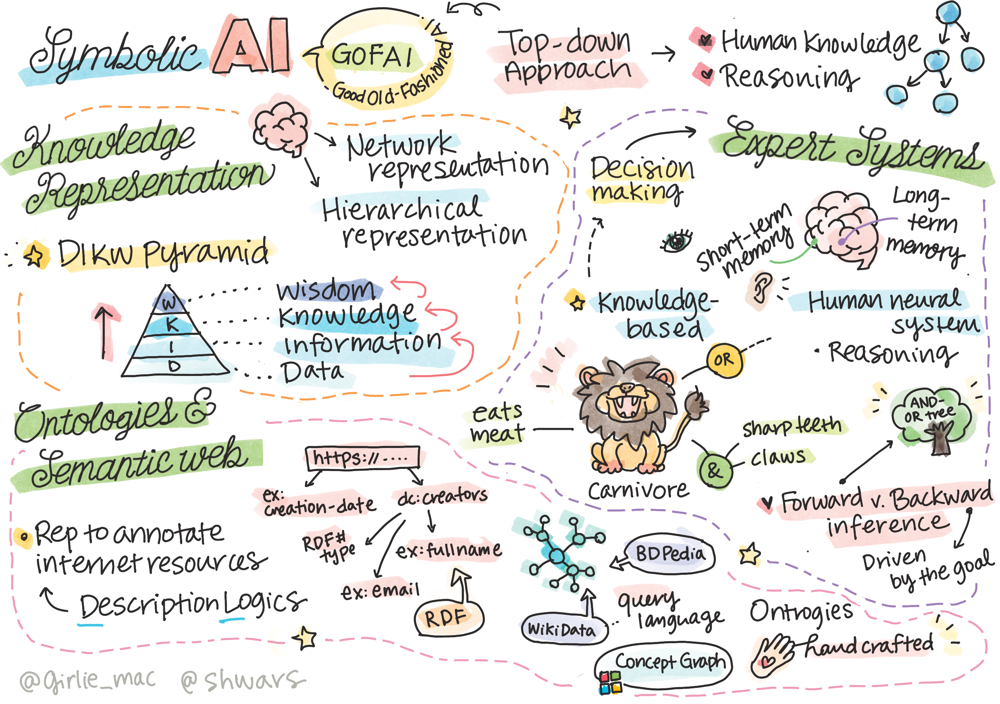

# 知识表示与专家系统



> 由 [Tomomi Imura](https://twitter.com/girlie_mac) 绘制的速记

对人工智能的探索基于对知识的追求，希望能够像人类一样理解世界。但如何实现这一目标呢？

## [课前测验](https://red-field-0a6ddfd03.1.azurestaticapps.net/quiz/102)

在人工智能的早期，创建智能系统的自上而下的方法（在前一课中讨论过）非常流行。其思想是从人们那里提取知识，转化为机器可读的形式，然后用它来自动解决问题。这种方法基于两大思想：

* 知识表示
* 推理

## 知识表示

符号 AI 中的重要概念之一是 **知识**。重要的是将知识与*信息*或*数据*区分开。例如，我们可以说书籍包含知识，因为我们可以通过学习书籍成为专家。然而，书籍中真正包含的是*数据*，通过阅读书籍并将这些数据整合到我们的世界模型中，我们将数据转化为知识。

> ✅ **知识** 是我们头脑中包含的内容，代表我们对世界的理解。它是通过一个主动的 **学习** 过程获得的，这个过程将我们接收到的信息片段整合到我们世界的活动模型中。

我们通常不会严格定义知识，而是通过 [DIKW 金字塔](https://en.wikipedia.org/wiki/DIKW_pyramid) 将其与其他相关概念对齐。它包含以下概念：

* **数据** 是以物理介质表示的内容，例如书面文字或口头话语。数据独立于人类存在，并且可以在人们之间传递。
* **信息** 是我们在头脑中解读数据的方式。例如，当我们听到 "计算机" 这个词时，我们对其有一定的理解。
* **知识** 是信息整合到我们的世界模型中的过程。例如，一旦我们学习到什么是计算机，我们就开始对其工作原理、成本及用途有一些概念。这些相互关联的概念网络形成了我们的知识。
* **智慧** 是我们对世界理解的更高一层次，代表了 *元知识*，即关于如何及何时使用知识的一些概念。


* 图片来源：[维基百科](https://commons.wikimedia.org/w/index.php?curid=37705247)，作者 Longlivetheux - 自作，CC BY-SA 4.0 *

因此，**知识表示** 的问题就是要找到一种有效的方法，将知识以数据的形式表示在计算机内部，使之能够自动化使用。这可以看作一个光谱：


> 图片来源：[Dmitry Soshnikov](http://soshnikov.com)

* 在左边，有非常简单的知识表示类型，计算机可以有效使用。最简单的是算法型，当知识用计算机程序表示时。然而，这不是表示知识的最佳方式，因为它不灵活。我们头脑中的知识通常是非算法性的。
* 在右边，有自然文本等表示方式。它是最强大的，但不能用于自动推理。

> ✅ 花一分钟时间思考你如何在头脑中表示知识并将其转化为笔记。是否有一种特定的格式能够促进记忆？

## 计算机知识表示的分类

我们可以将不同的计算机知识表示方法分为以下几类：

* **网络表示** 基于我们头脑中有一个互相关联的概念网络这一事实。我们可以尝试在计算机内重现相同的图网络——一个所谓的 **语义网络**。

1. **对象-属性-值三元组** 或 **属性-值对**。因为图可以在计算机内表示为节点和边的列表，我们可以通过一个三元组列表来表示语义网络，包含对象、属性和值。例如，我们可以构建以下关于编程语言的三元组：

对象 | 属性 | 值
-------|-----------|------
Python | 是 | 非类型化语言
Python | 发明者是 | Guido van Rossum
Python | 代码块语法 | 缩进
非类型化语言 | 没有 | 类型定义

> ✅ 想一想三元组如何用于表示其他类型的知识。

2. **层次表示** 强调我们在头脑中经常创建对象的层次结构。例如，我们知道金丝雀是一种鸟类，而所有鸟类都有翅膀。我们还对金丝雀的颜色及其飞行速度有一定的了解。

   - **框架表示** 基于将每个对象或对象类表示为一个 **框架**，其中包含 **槽**。槽可能有默认值、值限制或可以调用的存储过程以获得槽的值。所有框架形成一个类似于面向对象编程语言中对象层次结构的层次。
   - **情景** 是一种特殊的框架，代表可以随时间展开的复杂情境。

**Python**

槽 | 值 | 默认值 | 区间 |
-----|-------|---------------|----------|
名称 | Python | | |
是 | 非类型化语言 | | |
变量命名方式 | | CamelCase | |
程序长度 | | | 5-5000 行 |
代码块语法 | 缩进 | | |

3. **程序表示** 基于表示一系列当某种情况发生时可以执行的动作。
   - 生成规则是 if-then 语句，允许我们推断结论。例如，一位医生可能有一个规则说 **如果** 病人发烧 **或** 血液测试中 C 反应蛋白水平高 **则** 病人有炎症。一旦我们遇到其中一个条件，我们可以得出关于炎症的结论，然后在进一步推理中使用它。
   - 算法可以被认为是另一种形式的程序表示，尽管在知识库系统中几乎从未直接使用。

4. **逻辑** 最初由亚里士多德提出，用于表示普遍的人类知识。
   - 谓词逻辑作为一种数学理论，过于丰富而不可计算，因此通常使用它的某个子集，如在 Prolog 中使用的 Horn 子句。
   - 描述逻辑是一系列逻辑系统，用于表示和推理关于分布知识表示的对象层次结构，如 *语义网*。

## 专家系统

符号 AI 的早期成功之一是所谓的 **专家系统**——设计为在某一有限问题域中充当专家的计算机系统。它们基于从一个或多个人工专家中提取的 **知识库**，并且包含一个执行推理的 **推理引擎**。

 | 
---------------------------------------------|------------------------------------------------
简化的人类神经系统结构 | 基于知识系统的架构

专家系统的构建类似于人类推理系统，其中包含 **短期记忆** 和 **长期记忆**。同样，在基于知识的系统中我们区分以下组件：

* **问题记忆**：包含当前解决的问题的知识，即病人的体温或血压，是否有炎症等。这些知识也称为 **静态知识**，因为它包含我们当前对问题的了解的快照——所谓的 *问题状态*。
* **知识库**：代表关于问题域的长期知识。它从人工专家那里手动提取，并且在咨询之间不会改变。因为它允许我们从一个问题状态导航到另一个问题状态，它也称为 **动态知识**。
* **推理引擎**：协调整个问题状态空间中的搜索过程，在需要时向用户提问。它还负责为每个状态找到要应用的正确规则。

例如，让我们考虑以下基于动物外部特征确定动物的专家系统：


> 图片来源：[Dmitry Soshnikov](http://soshnikov.com)

此图称为 **AND-OR 树**，它是生产规则集的图形表示。绘制树在从专家提取知识的开始时很有用。为了在计算机内部表示知识，使用规则更加方便：

```
如果动物吃肉
或 (动物有尖牙
    且动物有爪子
    且动物有向前看的眼睛
) 
则动物是食肉动物
```

你可以注意到，每个规则左侧的条件和动作本质上都是对象-属性-值（OAV）三元组。**工作记忆** 包含与当前正在解决的问题相对应的 OAV 三元组集。**规则引擎** 搜索满足条件的规则并应用它们，将另一个三元组添加到工作记忆中。

> ✅ 在你喜欢的主题上编写你自己的 AND-OR 树！

### 前向推理与后向推理

上述过程称为 **前向推理**。它从工作记忆中可用的一些初始数据开始，然后执行以下推理循环：

1. 如果目标属性存在于工作记忆中，则停止并给出结果
2. 查找条件当前满足的所有规则——获得 **冲突集** 规则。
3. 执行 **冲突解决**——选择一个要在此步骤执行的规则。可能有不同的冲突解决策略：
   - 选择知识库中第一个适用的规则
   - 随机选择一个规则
   - 选择 *更具体* 的规则，即满足 "左侧"（LHS）中最多条件的规则
4. 应用选择的规则并将新知识插入问题状态
5. 从步骤1重新开始。

然而，在某些情况下，我们可能希望从一个关于问题的空白知识开始，并提出有助于我们得出结论的问题。例如，在进行医学诊断时，我们通常不会在开始诊断病人之前进行所有医学分析。我们希望在需要做出决策时进行分析。

此过程可以用 **后向推理** 建模。它由 **目标** 驱动——我们正在寻找的属性值：

1. 选择所有可以给我们目标值的规则（即在 RHS（"右侧"）中有目标）——冲突集
1. 如果没有该属性的规则，或者有规则表示我们应该问用户该值——询问它，否则：
1. 使用冲突解决策略选择一个我们将用作*假设*的规则——我们将尝试证明它
1. 递归地对规则 LHS 中的所有属性重复此过程，尝试证明它们为目标
1. 如果在任何时候进程失败——在步骤3中使用另一个规则。

> ✅ 哪些情况下前向推理更合适？后向推理呢？

### 实现专家系统

专家系统可以使用不同的工具实现：

* 直接在某些高级编程语言中编写它们。这不是最好的方法，因为基于知识的系统的主要优点是知识与推理分离，并且潜在问题域专家应能够编写规则而无需理解推理过程的详细信息。
* 使用 **专家系统外壳**，即专门设计为通过某种知识表示语言填充知识的系统。

## ✍️ 练习：动物推理

参见 [Animals.ipynb](https://github.com/microsoft/AI-For-Beginners/blob/main/lessons/2-Symbolic/Animals.ipynb) 获取如何实现前向和后向推理专家系统的示例。

> **注意**：这个示例相对简单，仅提供专家系统的外观概念。一旦你开始创建这样的系统，你将会注意到，只有当你达到一定数量的规则（大约200+）时，你才会看到一些 *智能* 行为。到某一时刻，规则变得过于复杂，无法全部记住，此时你可能会想知道为什么系统做出某些决策。然而，基于知识的系统的重要特征是你始终可以 *解释* 任何决策是如何做出的。

## 本体论与语义网

在二十世纪末，有一个使用知识表示来注释互联网资源的倡议，以便能够找到对应非常具体查询的资源。这一运动称为 **语义网**，它依赖于几个概念：

- 基于 **[描述逻辑](https://en.wikipedia.org/wiki/Description_logic)** (DL) 的特殊知识表示。它类似于框架知识表示，因为它构建了对象的层次结构和属性，但具有形式逻辑语义和推理。有一整套平衡表达能力和推理算法复杂性的 DL 家族。
- 分布式知识表示，其中所有概念都由全局 URI 标识符表示，使其能够创建跨越互联网的知识层次。
- 一族基于 XML 的知识描述语言：RDF（资源描述框架）、RDFS（RDF 架构）、OWL（本体网语言）。

语义网的核心概念是 **本体** 的概念。它指的是使用某种形式知识表示明确指定的问题域。最简单的本体可以只是问题域中的对象层次结构，但更复杂的本体将包括可用于推理的规则。

在语义网中，所有表示基于三元组。每个对象和每个关系都由 URI 唯一标识。例如，如果我们想要声明 AI 课程由 Dmitry Soshnikov 于 2022 年 1 月 1 日开发的事实，这里是可以使用的三元组：


```
http://github.com/microsoft/ai-for-beginners http://www.example.com/terms/creation-date "2022-01-01"
http://github.com/microsoft/ai-for-beginners http://purl.org/dc/elements/1.1/creator http://soshnikov.com
```

> ✅ 这里 `http://www.example.com/terms/creation-date` 和 `http://purl.org/dc/elements/1.1/creator` 是一些公认可表达 *创造者* 和 *创建日期* 概念的 URI。

在更复杂的情况下，如果我们想要定义一个创造者列表，我们可以使用 RDF 中定义的一些数据结构。


> 上图来源：[Dmitry Soshnikov](http://soshnikov.com)

语义网的进展因搜索引擎和自然语言处理技术的成功而有所放缓，这些技术允许从文本中提取结构化数据。然而，在某些领域仍有显著的努力来维护本体论和知识库。一些值得注意的项目：

* [WikiData](https://wikidata.org/) 是与维基百科关联的机器可读知识库的集合。大多数数据从维基百科 *信息框* 中挖掘出来，这些信息框是维基百科页面中的结构化内容。你可以用 SPARQL（语义网的特殊查询语言）[查询](https://query.wikidata.org/) Wikidata。这是一个显示人类中最流行的眼睛颜色的示例查询：

```sparql
#defaultView:BubbleChart
SELECT ?eyeColorLabel (COUNT(?human) AS ?count)
WHERE
{
  ?human wdt:P31 wd:Q5.       # human instance-of homo sapiens
  ?human wdt:P1340 ?eyeColor. # human eye-color ?eyeColor
  SERVICE wikibase:label { bd:serviceParam wikibase:language "en". }
}
GROUP BY ?eyeColorLabel
```

* [DBpedia](https://www.dbpedia.org/) 是另一个类似 WikiData 的努力。

> ✅ 如果你想体验构建自己的本体论或打开现有的本体论，有一个很棒的视觉本体编辑器叫做 [Protégé](https://protege.stanford.edu/)。下载它，或者在线使用。


*Web Protégé 编辑器打开了罗曼诺夫家庭的本体。截图由 Dmitry Soshnikov 提供*

## ✍️ 练习：一个家庭本体论

参见 [FamilyOntology.ipynb](https://github.com/Ezana135/AI-For-Beginners/blob/main/lessons/2-Symbolic/FamilyOntology.ipynb) 获取一个使用语义网技术来推理家族关系的示例。我们将使用通用 GEDCOM 格式表示的家谱和家庭关系本体，为给定的一组个人构建所有家庭关系的图。

## Microsoft Concept Graph

在大多数情况下，本体论是由人工细心创建的。然而，也有可能从非结构化数据中 **挖掘** 本体论，例如，从自然语言文本中。

微软研究院做了一次这样的尝试，并得出了 [Microsoft Concept Graph](https://blogs.microsoft.com/ai/microsoft-researchers-release-graph-that-helps-machines-conceptualize/?WT.mc_id=academic-77998-cacaste)。

它是一个使用 `is-a` 继承关系将实体分组在一起的大型集合。它允许回答诸如 "什么是微软公司？" 这样的问题——答案类似于 "一个公司，概率为 0.87，一个品牌，概率为 0.75"。

该图可以作为 REST API 使用，或者作为一个包含所有实体对的大型可下载文本文件。

## ✍️ 练习：概念图

尝试 [MSConceptGraph.ipynb](https://github.com/microsoft/AI-For-Beginners/blob/main/lessons/2-Symbolic/MSConceptGraph.ipynb) 笔记本，了解如何使用 Microsoft Concept Graph 将新闻文章分组到多个类别中。

## 结论

如今，AI 经常被认为是 *机器学习* 或 *神经网络* 的同义词。然而，人类还展现出明确的推理能力，而这是当前神经网络尚未处理的内容。在实际项目中，明确推理仍然被用来完成需要解释或能够以可控方式修改系统行为的任务。

## 🚀 挑战

在与本课相关的“家族本体”笔记本中，可以尝试探索其他家庭关系。试着发现家谱中人与人之间的新连接。

## [课后测验](https://red-field-0a6ddfd03.1.azurestaticapps.net/quiz/202)

## 复习与自学

通过互联网进行研究，发现人类尝试量化和编码知识的领域。了解布鲁姆分类法（Bloom's Taxonomy），并回顾历史，了解人类如何尝试理解他们的世界。探索林奈（Linnaeus）对生物进行分类的工作，并观察德米特里·门捷列夫（Dmitri Mendeleev）如何为化学元素创建描述和分组的方法。你还能找到哪些有趣的例子？

**作业**: [构建本体](assignment_chs.md)
