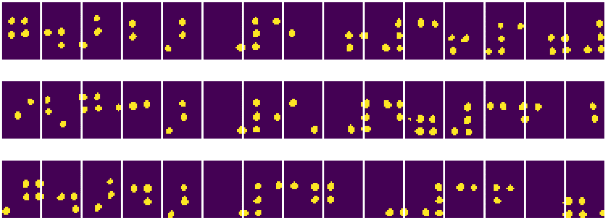
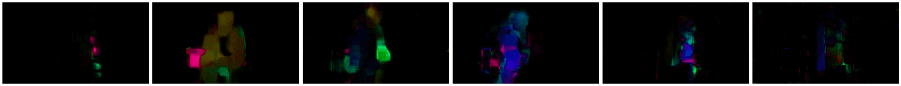

# 计算机视觉简介

[计算机视觉](https://wikipedia.org/wiki/Computer_vision) 是一个学科，其目标是使计算机能够对数字图像进行高水平的理解。这是一个相当广泛的定义，因为*理解*可以意味着许多不同的事情，包括在图片中找到一个物体（**物体检测**），理解正在发生的事情（**事件检测**），用文本描述图片，或者在3D中重建场景。还有一些与人类图像相关的特殊任务：年龄和情绪估计、面部检测和识别，以及3D姿态估计，等等。

## [课前小测验](https://red-field-0a6ddfd03.1.azurestaticapps.net/quiz/106)

计算机视觉最简单的任务之一是**图像分类**。

计算机视觉通常被认为是人工智能的一个分支。如今，大多数计算机视觉任务都是通过神经网络来解决的。我们将在本节中详细学习用于计算机视觉的特殊类型神经网络[卷积神经网络](../07-ConvNets/README_chs.md)。

然而，在将图像传递给神经网络之前，在许多情况下使用一些算法技术来增强图像是有意义的。

有几个用于图像处理的Python库：

* **[imageio](https://imageio.readthedocs.io/en/stable/)** 可用于读写不同的图像格式。它还支持 ffmpeg，一个将视频帧转换为图像的有用工具。
* **[Pillow](https://pillow.readthedocs.io/en/stable/index.html)**（也称为 PIL）更强大一些，还支持一些图像操作，如变形、调色板调整等。
* **[OpenCV](https://opencv.org/)** 是一个用 C++ 编写的强大图像处理库，已成为图像处理的*事实标准*。它有一个方便的 Python 接口。
* **[dlib](http://dlib.net/)** 是一个实现了许多机器学习算法的 C++ 库，包括一些计算机视觉算法。它也有一个 Python 接口，可以用于面部和面部特征检测等具有挑战性的任务。

## OpenCV

[OpenCV](https://opencv.org/) 被认为是图像处理的*事实标准*。它包含许多有用的算法，用 C++ 实现。你也可以从 Python 调用 OpenCV。

学习 OpenCV 的一个好地方是[这个 Learn OpenCV 课程](https://learnopencv.com/getting-started-with-opencv/)。在我们的课程中，我们的目标不是学习 OpenCV，而是向你展示它可以在何时和如何使用的一些示例。

### 加载图像

在Python中，图像可以方便地用 NumPy 数组表示。例如，320x200 像素大小的灰度图像将存储在 200x320 数组中，而相同尺寸的彩色图像将具有 200x320x3 的形状（3 个颜色通道）。要加载图像，可以使用以下代码：

```python
import cv2
import matplotlib.pyplot as plt

im = cv2.imread('image.jpeg')
plt.imshow(im)
```

传统上，OpenCV 使用 BGR（蓝-绿-红）编码彩色图像，而其余的 Python 工具使用更传统的 RGB（红-绿-蓝）。为了让图像看起来正确，你需要将其转换为 RGB 颜色空间，可以通过交换 NumPy 数组中的维度，或者调用一个 OpenCV 函数：

```python
im = cv2.cvtColor(im,cv2.COLOR_BGR2RGB)
```

同样的 `cvtColor` 函数可以用于执行其他颜色空间转换，例如将图像转换为灰度或 HSV（色调-饱和度-值）颜色空间。

你还可以使用 OpenCV 一帧一帧地加载视频 - 示例在练习 [OpenCV Notebook](OpenCV.ipynb) 中提供。

### 图像处理

在将图像传递给神经网络之前，你可能想要进行几个预处理步骤。OpenCV 可以做许多事情，包括：

* 使用 `im = cv2.resize(im, (320,200),interpolation=cv2.INTER_LANCZOS)` **调整**图像大小
* 使用 `im = cv2.medianBlur(im,3)` 或 `im = cv2.GaussianBlur(im, (3,3), 0)` **模糊**图像
* 可以通过 NumPy 数组操作改变图像的**亮度和对比度**，如[这个 Stackoverflow 笔记](https://stackoverflow.com/questions/39308030/how-do-i-increase-the-contrast-of-an-image-in-python-opencv)中描述的那样。
* 通过调用 `cv2.threshold` / `cv2.adaptiveThreshold` 函数使用[阈值处理](https://docs.opencv.org/4.x/d7/d4d/tutorial_py_thresholding.html)，这通常比调整亮度或对比度更可取。
* 应用不同的[变换](https://docs.opencv.org/4.5.5/da/d6e/tutorial_py_geometric_transformations.html)到图像：
    - **[仿射变换](https://docs.opencv.org/4.5.5/d4/d61/tutorial_warp_affine.html)** 如果你需要对图像进行旋转、调整大小和倾斜并且你知道图像中三点的源位置和目标位置时会很有用。仿射变换保持平行线平行。
    - **[透视变换](https://medium.com/analytics-vidhya/opencv-perspective-transformation-9edffefb2143)** 当你知道图像中四个点的源位置和目标位置时会很有用。例如，如果你用智能手机从某个角度拍摄矩形文档，并且你想使文档本身的图像成为矩形。
* 使用**[光流](https://docs.opencv.org/4.5.5/d4/dee/tutorial_optical_flow.html)** 理解图像中内部的运动。

## 使用计算机视觉的示例

在我们的[OpenCV Notebook](OpenCV.ipynb)中，我们提供了一些计算机视觉可以用于执行特定任务的示例：

* **预处理盲文书的照片**。我们重点讨论如何使用阈值处理、特征检测、透视变换和 NumPy 操作来分离单独的盲文符号，以便神经网络进一步分类。

 |  | 
----|-----|-----

> 图片来自 [OpenCV.ipynb](OpenCV.ipynb)

* **使用帧差异检测视频中的运动**。如果摄像机是固定的，那么从摄像机提供的帧应该彼此非常相似。由于帧表示为数组，只需减去两个连续帧的数组，我们就会得到像素差异，静态帧的差异应该较小，当图像中有明显运动时，差异会增加。


> 图片来自 [OpenCV.ipynb](OpenCV.ipynb)

* **使用光流检测运动**。 [光流](https://docs.opencv.org/3.4/d4/dee/tutorial_optical_flow.html) 允许我们理解视频帧上单个像素的移动方式。光流有两种类型：

   - **密集光流** 计算矢量场，显示每个像素的运动方向
   - **稀疏光流** 基于捕捉图像中的一些明显特征（例如边缘），并建立它们从帧到帧的轨迹。



> 图片来自 [OpenCV.ipynb](OpenCV.ipynb)

## ✍️ 示例笔记本：OpenCV [尝试 OpenCV 动作演示](OpenCV.ipynb)

让我们通过探索 [OpenCV 笔记本](OpenCV.ipynb) 来做一些 OpenCV 的实验

## 结论

有时，像运动检测或指尖检测这样的复杂任务可以纯粹通过计算机视觉来解决。因此，了解计算机视觉的基本技术以及像 OpenCV 这样的库能做什么是非常有帮助的。

## 🚀 挑战

观看 [这段视频](https://docs.microsoft.com/shows/ai-show/ai-show--2021-opencv-ai-competition--grand-prize-winners--cortic-tigers--episode-32?WT.mc_id=academic-77998-cacaste)，了解 Cortic Tigers 项目以及他们如何构建基于块的解决方案来民主化通过机器人执行的计算机视觉任务。研究其他类似的项目，这些项目有助于新学习者进入这个领域。

## [课后小测验](https://red-field-0a6ddfd03.1.azurestaticapps.net/quiz/206)

## 复习与自学

在[这个出色的教程](https://learnopencv.com/optical-flow-in-opencv/)中阅读更多关于光流的信息。

## [作业](lab/README_chs.md)

在这个实验中，你将录制一个包含简单手势的视频，你的目标是使用光流提取上/下/左/右的运动。


