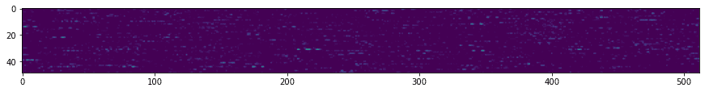
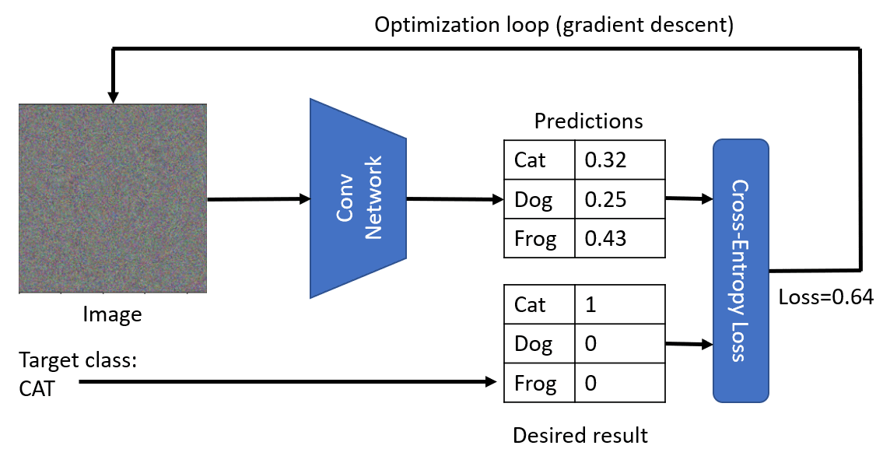
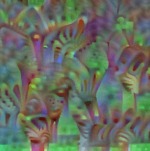

# 预训练网络和迁移学习

训练卷积神经网络（CNN）需要很多时间，而且需要大量数据。大部分时间都花在学习网络可以用来从图像中提取模式的最佳低级滤波器上。一个自然的问题出现了——我们能否使用一个在一个数据集上训练好的神经网络，并适应它来分类不同的图像，而不需要完整的训练过程呢？

## [课前测验](https://red-field-0a6ddfd03.1.azurestaticapps.net/quiz/108)

这种方法被称为**迁移学习**，因为我们将一些知识从一个神经网络模型转移到另一个模型中。在迁移学习中，我们通常从一个预训练模型开始，该模型已经在一些大型图像数据集（如 **ImageNet**）上进行了训练。这些模型已经能够很好地从通用图像中提取不同的特征，在许多情况下，仅仅在这些提取的特征之上构建一个分类器就能产生良好的结果。

> ✅ 迁移学习是您在其他学术领域（如教育）中会发现的术语。它指的是将一个领域的知识应用到另一个领域的过程。

## 预训练模型作为特征提取器

我们在前一部分中讨论的卷积网络包含多个层，每一层都应该从图像中提取一些特征，从低级像素组合（如水平/垂直线或笔画），到更高级的特征组合，类似于火焰的眼睛。如果我们在足够大的通用和多样化的图像数据集上训练 CNN，网络应该能够学习提取这些常见特征。

Keras 和 PyTorch 都包含函数来轻松加载一些常见架构的预训练神经网络权重，其中大多数是在 ImageNet 图像上训练的。最常用的模型在上一课的[CNN架构](../07-ConvNets/CNN_Architectures_chs.md)页面进行了描述。特别地，您可能需要考虑使用以下模型之一：

* **VGG-16/VGG-19** 是相对简单的模型，但仍能提供良好的准确性。通常使用 VGG 作为第一个尝试是一个好的选择，以查看迁移学习的效果。
* **ResNet** 是微软研究院在2015年提出的一系列模型。它们有更多的层，因此需要更多的资源。
* **MobileNet** 是一系列具有较小尺寸的模型，适用于移动设备。如果您资源紧缺且能牺牲一点准确性，请使用它们。

以下是 VGG-16 网络从一张猫的图片中提取的特征示例：

## 猫与狗数据集

在这个示例中，我们将使用一个[猫和狗](https://www.microsoft.com/download/details.aspx?id=54765&WT.mc_id=academic-77998-cacaste)的数据集，这非常接近真实的图像分类场景。

## ✍️ 练习：迁移学习

让我们看看在对应的笔记本中迁移学习的实际应用：

* [迁移学习 - PyTorch](TransferLearningPyTorch.ipynb)
* [迁移学习 - TensorFlow](TransferLearningTF.ipynb)

## 可视化对抗性猫

预训练的神经网络在其“脑”中包含不同的模式，包括**理想猫**（以及理想狗、理想斑马等）的概念。以某种方式**可视化这个图像**将会非常有趣。然而，这并不简单，因为模式分布在网络权重中的各个位置，还组织成一个分层结构。

我们可以采取的一种方法是从一个随机图像开始，然后尝试使用**梯度下降优化**技术来调整该图像，使网络认为它是一只猫。

然而，如果我们这样做，我们将得到一些非常类似随机噪声的东西。这是因为*有很多方法可以让网络认为输入图像是一只猫*，包括一些在视觉上没有意义的方法。虽然这些图像包含了很多典型的猫的模式，但没有什么能约束它们在视觉上是独特的。

为了改进结果，我们可以在损失函数中加入另一个项，称为**变异损失**。它是一种度量，显示了图像相邻像素的相似程度。最小化变异损失使图像更平滑，消除噪声，从而揭示更具视觉吸引力的模式。下面是一些 “理想” 图像的例子，它们被高度概率地分类为猫和斑马：

 | 
-----|-----
*理想猫* | *理想斑马*

类似的方法可以用来对神经网络进行所谓的**对抗性攻击**。假设我们想要欺骗一个神经网络，使一只狗看起来像一只猫。如果我们拍一张被网络识别为狗的狗的图像，然后使用梯度下降优化对其稍微调整一下，直到网络开始将其分类为猫：

 | 
-----|-----
*狗的原始图片* | *被分类为猫的狗的图片*

参见以下笔记本中的代码以重现上述结果：

* [理想和对抗性猫 - TensorFlow](AdversarialCat_TF.ipynb)
## 结论

通过迁移学习，您可以快速拼凑出一个自定义对象分类任务的分类器，并且达到高准确度。您可以看到我们现在解决的更复杂的任务需要更高的计算能力，并且不能轻松地在 CPU 上解决。在下一单元，我们将尝试使用更轻量的实现来训练相同的模型，使用更低的计算资源，其结果只是略低的准确性。

## 🚀 挑战

在随附的笔记本中，底部有关于如何最好地利用相似训练数据（例如一种新类型的动物）的迁移知识的备注。请进行一些实验，使用完全新类型的图像，看看您的迁移知识模型执行得如何。

## [课后测验](https://red-field-0a6ddfd03.1.azurestaticapps.net/quiz/208)

## 复习与自学

阅读 [TrainingTricks_chs.md](TrainingTricks_chs.md) 以加深您对其他一些训练模型方法的了解。

## [作业](lab/README_chs.md)

在此实验中，我们将使用真实的 [Oxford-IIIT](https://www.robots.ox.ac.uk/~vgg/data/pets/) 宠物数据集，该数据集包含35种猫狗品种，并且我们将构建一个迁移学习分类器。