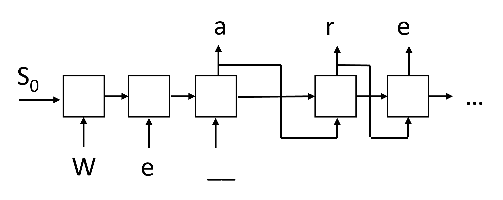

# 生成网络

## [课前测验](https://red-field-0a6ddfd03.1.azurestaticapps.net/quiz/117)

循环神经网络（RNNs）及其门控单元变体，例如长短期记忆单元（LSTMs）和门控循环单元（GRUs），提供了一种语言建模机制，因为它们可以学习单词排序并为序列中的下一个单词提供预测。这使我们能够使用RNN进行**生成任务**，例如普通文本生成、机器翻译，甚至图片描述。

> ✅ 想想在你打字时从生成任务（如文本完成）中受益的所有情形。研究一下你喜欢的应用程序，看看它们是否利用了RNN。

在我们在前一单元中讨论的RNN架构中，每个RNN单元都生成下一个隐藏状态作为输出。然而，我们也可以为每个循环单元添加另一个输出，这将允许我们输出一个**序列**（该序列长度等于原始序列）。此外，我们可以使用不在每一步接受输入的RNN单元，只需接受一些初始状态向量，然后生成一系列输出。

这允许不同的神经架构，如下图所示：


> 图片来自博文 [循环神经网络的无限有效性](http://karpathy.github.io/2015/05/21/rnn-effectiveness/) 作者 [Andrej Karpaty](http://karpathy.github.io/)

* **一对一**是一个传统的神经网络，具有一个输入和一个输出
* **一对多**是一种生成架构，接受一个输入值，并生成一系列输出值。例如，如果我们想训练一个**图像描述**网络，它将生成图片的文本描述，我们可以将图片作为输入，通过CNN获得其隐藏状态，然后让一个循环链逐字生成描述
* **多对一**对应于我们在前一单元中描述的RNN架构，如文本分类
* **多对多**或**序列对序列**对应于任务如**机器翻译**，其中我们先有RNN将输入序列的所有信息收集到隐藏状态中，然后另一个RNN链将该状态展开为输出序列。

在本单元中，我们将专注于帮助我们生成文本的简单生成模型。为了简化，我们将使用字符级别的标记化。

我们将训练这个RNN一步步生成文本。在每一步，我们将获取长度为`nchars`的字符序列，并要求网络为每个输入字符生成下一个输出字符：


在生成文本（推理过程中），我们从一些**提示**开始，将其传递通过RNN单元以生成其中间状态，然后从该状态开始生成。我们一次生成一个字符，并将状态和生成的字符传递给另一个RNN单元以生成下一个字符，直到生成足够的字符。



> 作者提供的图片

## ✍️ 练习：生成网络

在以下笔记本中继续学习：

* [使用PyTorch的生成网络](GenerativePyTorch.ipynb)
* [使用TensorFlow的生成网络](GenerativeTF.ipynb)

## 软文本生成和温度

每个RNN单元的输出是字符的概率分布。如果我们始终选择概率最高的字符作为生成文本的下一个字符，文本通常可能会在相同的字符序列之间“循环”反复，如下例所示：

```
today of the second the company and a second the company ...
```

然而，如果我们查看下一个字符的概率分布，可能几个最高概率之间的差异并不大，例如一个字符的概率可以是0.2，另一个是0.19，等等。例如，当寻找序列'*play*'的下一个字符时，下一个字符可以同样可能是空格或**e**（如单词*player*）。

这使我们得出结论：选择概率较高的字符并不总是“公平的”，因为选择概率第二高的字符仍然可能会导致有意义的文本。更明智的方法是从网络输出给出的概率分布中**抽样**字符。我们还可以使用一个参数，**温度**，来平滑概率分布，以便在我们希望增加更多随机性或希望更多地坚持最高概率字符时加以调整。

探索上述笔记本中如何实现这种软文本生成。

## 结论

尽管文本生成本身可能有用，但主要的好处来自于能够使用RNN根据一些初始特征向量生成文本。例如，文本生成用作机器翻译的一部分（序列到序列，在这种情况下状态向量来自*编码器*，用于生成或*解码*原文），或生成图像的文本描述（在这种情况下特征向量来自CNN提取器）。

## 🚀 挑战

在Microsoft Learn上上这方面的课程

* 使用[PyTorch](https://docs.microsoft.com/learn/modules/intro-natural-language-processing-pytorch/6-generative-networks/?WT.mc_id=academic-77998-cacaste)/[TensorFlow](https://docs.microsoft.com/learn/modules/intro-natural-language-processing-tensorflow/5-generative-networks/?WT.mc_id=academic-77998-cacaste)进行文本生成

## [课后测验](https://red-field-0a6ddfd03.1.azurestaticapps.net/quiz/217)

## 复习与自学

这里有一些文章可以扩展你的知识

* 不同方法生成文本：马尔可夫链、LSTM和GPT-2: [博文](https://towardsdatascience.com/text-generation-gpt-2-lstm-markov-chain-9ea371820e1e)
* [Keras文档](https://keras.io/examples/generative/lstm_character_level_text_generation/)中的文本生成示例

## [作业](lab/README_chs.md)

我们已经看到了如何逐字生成文本。在实验中，你将探索词级别的文本生成。