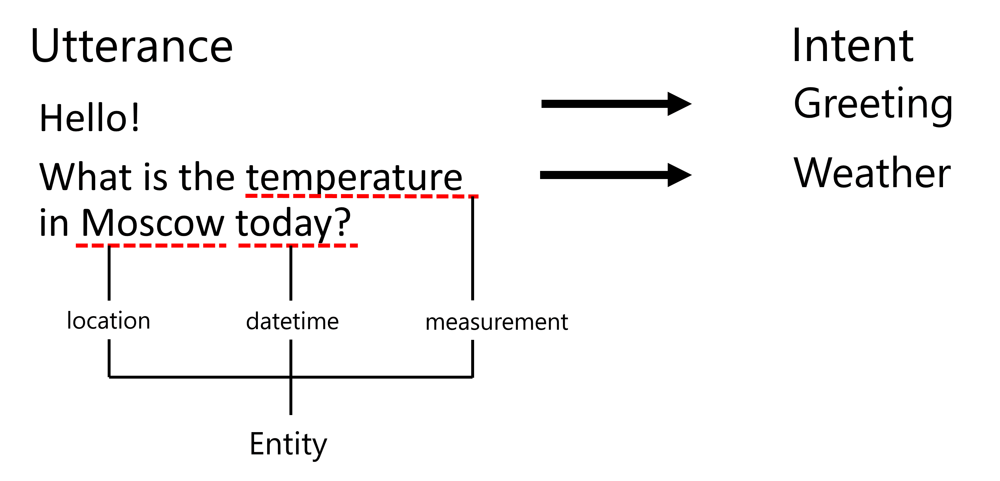

# 命名实体识别

到目前为止，我们主要集中在一个自然语言处理任务 - 分类。然而，还有其他可以通过神经网络完成的自然语言处理任务。其中一个任务是**[命名实体识别](https://wikipedia.org/wiki/Named-entity_recognition)** (NER)，它处理识别文本中的特定实体，如地点、人物姓名、日期时间间隔、化学公式等。

## [课前测验](https://red-field-0a6ddfd03.1.azurestaticapps.net/quiz/119)

## 使用NER的示例

假设你想开发一个类似于Amazon Alexa或Google Assistant的自然语言聊天机器人。智能聊天机器人的工作方式是通过对输入句子进行文本分类来*理解*用户的需求。这个分类的结果被称为**意图**，它决定了聊天机器人应该做什么。

> 图片由作者提供

然而，用户可能会在短语中提供一些参数。例如，当问天气时，她可能会指定位置或日期。机器人应该能够理解这些实体，并在执行操作之前相应地填写参数槽。这正是NER的用途所在。

> ✅ 另一个例子是[分析科学医学论文](https://soshnikov.com/science/analyzing-medical-papers-with-azure-and-text-analytics-for-health/)。我们需要查找的主要是特定的医学术语，如疾病和药品名称。虽然少量疾病可能可以使用子字符串搜索提取，复杂的实体如化学化合物和药品名称则需要更复杂的方法。

## NER作为Token分类

NER模型本质上是**token分类模型**，因为对于每个输入的token，我们需要决定它是否属于某个实体，如果是 - 属于哪个实体类别。

考虑以下论文标题：

**三尖瓣反流**和**碳酸锂**中毒在新生儿中的病情。

这里的实体是：

* 三尖瓣反流是一种疾病 (`DIS`)
* 碳酸锂是一种化学物质 (`CHEM`)
* 中毒也是一种疾病 (`DIS`)

注意一个实体可能跨越多个token。而且，如在这种情况下，我们需要区分两个连续的实体。因此，通常使用两个类来表示每个实体 - 一个指定实体的第一个token（通常使用`B-`前缀，表示**开始**），另一个表示实体的延续（`I-`，表示**内部token**）。我们还使用`O`作为类别来表示所有**其他**token。这样的token标记称为[BIO标记](https://en.wikipedia.org/wiki/Inside%E2%80%93outside%E2%80%93beginning_(tagging))（或IOB）。标记后，我们的标题看起来是这样的：

Token | Tag
------|-----
三尖瓣 | B-DIS
反流 | I-DIS
和 | O
碳酸锂 | B-CHEM
中毒 | I-CHEM
在 | O
新生儿 | O
中的 | O
病情 | O
。 | O

由于我们需要在token和类之间建立一对一的对应关系，我们可以从这个图中训练一个最右侧的**多对多**神经网络模型：

> *图片来自[这篇博客文章](http://karpathy.github.io/2015/05/21/rnn-effectiveness/)由[Andrej Karpathy](http://karpathy.github.io/)撰写。NER token分类模型对应于图片中最右边的网络架构。*

## 训练NER模型

由于NER模型本质上是一个token分类模型，我们可以利用我们已经熟悉的RNN完成这个任务。在这种情况下，每块递归网络将返回token ID。以下示例笔记本展示了如何训练用于token分类的LSTM。

## ✍️ 示例笔记本: NER

在以下笔记本中继续学习：

* [NER与TensorFlow](NER-TF.ipynb)

## 结论

一个NER模型是一个**token分类模型**，这意味着它可以用来执行token分类。这是在NLP中非常常见的任务，有助于识别文本中的特定实体，包括地点、名字、日期等等。

## 🚀 挑战

完成下面链接的作业，训练一个医学术语命名实体识别模型，然后尝试在不同的数据集上进行实验。

## [课后测验](https://red-field-0a6ddfd03.1.azurestaticapps.net/quiz/219)

## 复习和自学

阅读博客[递归神经网络的非凡有效性](http://karpathy.github.io/2015/05/21/rnn-effectiveness/)并按照文章中的深入阅读部分进行学习，以加深你的知识。

## [作业](lab/README_chs.md)

在本课的作业中，你需要训练一个医学实体识别模型。你可以从训练LSTM模型开始，正如本课所述，然后使用BERT转换器模型。阅读[指示](lab/README_chs.md)以获取所有详情。