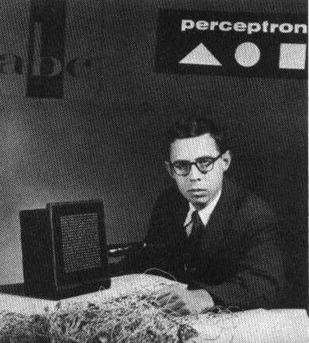
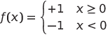

# 神经网络入门：感知器

## [课前测验](https://red-field-0a6ddfd03.1.azurestaticapps.net/quiz/103)

1957年，康奈尔航空实验室的Frank Rosenblatt首次尝试实现类似于现代神经网络的东西。这是一种名为"Mark-1"的硬件实现，旨在识别原始几何图形，如三角形、正方形和圆形。

|  |  |
|------------------------------------------------------|---------------------------------------------------------------|

> 图片来源 [维基百科](https://en.wikipedia.org/wiki/Perceptron)

输入图像由20×20光电池阵列表示，因此神经网络有400个输入和一个二进制输出。一个简单的网络包含一个神经元，也称为一个**阈值逻辑单元**。神经网络的权重像电位器一样在训练阶段需要手动调整。

> ✅ 电位器是一种允许用户调整电路电阻的装置。

> 《纽约时报》当时写道感知器：*海军期望的电子计算机的胚胎，将能够行走、谈话、看见、写字、复制自己并意识到自己的存在。*

## 感知器模型

假设我们的模型中有N个特征，在这种情况下，输入向量将是大小为N的向量。感知器是一个**二分类**模型，即它可以区分两类输入数据。我们将假设对于每个输入向量x，感知器的输出将根据类别为+1或-1。输出将使用以下公式计算：

y(x) = f(w<sup>T</sup>x)

其中f是一个阶跃激活函数

<!-- img src="http://www.sciweavers.org/tex2img.php?eq=f%28x%29%20%3D%20%5Cbegin%7Bcases%7D%0A%20%20%20%20%20%20%20%20%20%2B1%20%26%20x%20%5Cgeq%200%20%5C%5C%0A%20%20%20%20%20%20%20%20%20-1%20%26%20x%20%3C%200%0A%20%20%20%20%20%20%20%5Cend%7Bcases%7D%20%5C%5C%0A&bc=White&fc=Black&im=jpg&fs=12&ff=arev&edit=0" align="center" border="0" alt="f(x) = \begin{cases} +1 & x \geq 0 \\ -1 & x < 0 \end{cases} \\" width="154" height="50" / -->


## 训练感知器

要训练一个感知器，我们需要找到一个权重向量w，该向量可以正确分类大多数值，即使**错误**最小化。这个错误E由以下方式定义的**感知器准则**来定义：

E(w) = -&sum;w<sup>T</sup>x<sub>i</sub>t<sub>i</sub>

其中：

* 求和在那些导致错误分类的训练数据点i上进行
* x<sub>i</sub>是输入数据，t<sub>i</sub>分别对负例和正例为-1或+1。

这个准则被认为是权重w的函数，因此我们需要最小化它。通常使用一种称为**梯度下降**的方法，我们从某些初始权重w<sup>(0)</sup>开始，然后在每一步中根据以下公式更新权重：

w<sup>(t+1)</sup> = w<sup>(t)</sup> - &eta;&nabla;E(w)

这里的&eta;是所谓的**学习率**，&nabla;E(w)表示E的**梯度**。在计算梯度之后，我们得到

w<sup>(t+1)</sup> = w<sup>(t)</sup> + &sum;&eta;x<sub>i</sub>t<sub>i</sub>

Python中的算法如下所示：

```python
def train(positive_examples, negative_examples, num_iterations = 100, eta = 1):

    weights = [0,0,0] # 初始化权重（几乎是随机的 :)
        
    for i in range(num_iterations):
        pos = random.choice(positive_examples)
        neg = random.choice(negative_examples)

        z = np.dot(pos, weights) # 计算感知器输出
        if z < 0: # 将正例分类为负例
            weights = weights + eta*weights.shape

        z = np.dot(neg, weights)
        if z >= 0: # 将负例分类为正例
            weights = weights - eta*weights.shape

    return weights
```

## 结论

在本课中，你学习了感知器，这是一种二分类模型，以及如何通过使用权重向量来训练它。

## 🚀 挑战

如果你想尝试构建你自己的感知器，请试试[微软学习中的这个实验](https://docs.microsoft.com/zh-cn/azure/machine-learning/component-reference/two-class-averaged-perceptron?WT.mc_id=academic-77998-cacaste)，它使用了[Azure ML designer](https://docs.microsoft.com/zh-cn/azure/machine-learning/concept-designer?WT.mc_id=academic-77998-cacaste)。

## [课后测验](https://red-field-0a6ddfd03.1.azurestaticapps.net/quiz/203)

## 复习与自学

要查看我们如何使用感知器来解决玩具问题以及实际问题，并继续学习，请访问[感知器](Perceptron.ipynb)笔记本。

这里有一篇有趣的[关于感知器的文章](https://towardsdatascience.com/what-is-a-perceptron-basics-of-neural-networks-c4cfea20c590)。

## [作业](lab/README.md)

在本课中，我们实现了一个用于二分类任务的感知器，并用它来区分类似于手写数字的两类。在这个实验中，你需要完整地解决数字分类问题，即确定给定图像最有可能对应的数字。

* [说明](lab/README.md)
* [笔记本](lab/PerceptronMultiClass.ipynb)