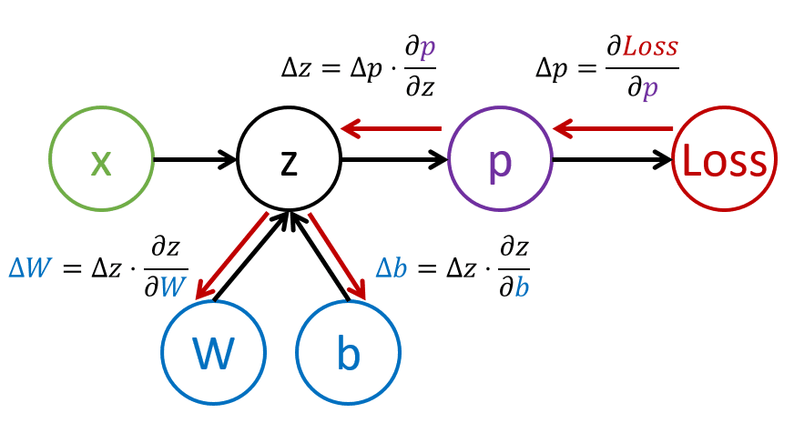

# 神经网络介绍. 多层感知器

在上一节中，你了解了最简单的神经网络模型 - 单层感知器，这是一个线性双类分类模型。

在本节中，我们将扩展这个模型到一个更灵活的框架，允许我们：

* 除了双类之外，还能执行**多类分类**
* 除了分类之外，还能解决**回归问题**
* 分离那些不是线性可分的类

我们还将开发我们自己的 Python 模块化框架，允许我们构建不同的神经网络架构。

## [课前测验](https://red-field-0a6ddfd03.1.azurestaticapps.net/quiz/104)

## 机器学习形式化

让我们先形式化机器学习问题。假设我们有一个带有标签 **Y** 的训练数据集 **X**，我们需要构建一个模型 *f*，以使其预测最准确。预测质量由**损失函数** &lagran; 测量。以下损失函数经常使用：

* 对于回归问题，当我们需要预测一个数值时，我们可以使用**绝对误差** &sum;i|f(x(i))-y(i)| 或**平方误差** &sum;i(f(x(i))-y(i))2
* 对于分类，我们使用**0-1损失**（实际上与模型的**准确度**相同）或**逻辑损失**。

对于单层感知器，函数 *f* 被定义为线性函数 *f(x)=wx+b*（这里 *w* 是权重矩阵，*x* 是输入特征向量，*b* 是偏置向量）。对于不同的神经网络架构，这个函数可以采用更复杂的形式。

> 在分类的情况下，通常希望获得对应类别的概率作为网络输出。为了将任意数值转换为概率（例如规范化输出），我们通常使用**softmax** 函数 &sigma;，函数 *f* 变为 *f(x)=&sigma;(wx+b)*

在上述 *f* 的定义中，*w* 和 *b* 被称为**参数** &theta;=⟨*w,b*⟩。给定数据集⟨**X**,**Y**⟩，我们可以计算整个数据集上的总体误差作为参数 &theta; 的函数。

> ✅ **神经网络训练的目标是通过改变参数 &theta; 来最小化误差**

## 梯度下降优化

有一种众所周知的函数优化方法称为**梯度下降**。其思想是我们可以计算损失函数相对于参数的导数（在多维情况下称为**梯度**），并以这种方式改变参数，使得误差减少。这可以形式化如下：

* 通过一些随机值 w(0), b(0) 初始化参数
* 重复以下步骤多次：
    - w(i+1) = w(i)-&eta;&part;&lagran;/&part;w
    - b(i+1) = b(i)-&eta;&part;&lagran;/&part;b

在训练过程中，假设优化步骤是考虑整个数据集来计算的（记住，损失是根据所有训练样本的总和计算的）。然而，在实际生活中，我们取称为**小批量**的小部分数据集，并基于数据子集计算梯度。因为每次子集是随机取的，这种方法称为**随机梯度下降**（SGD）。

## 多层感知器和反向传播

正如我们上面所见的，一个层的网络能够对线性可分的类进行分类。为了构建一个更丰富的模型，我们可以将网络的几层组合起来。数学上，这意味着函数 *f* 将具有更复杂的形式，并将在几个步骤中计算：
* z1=w1x+b1
* z2=w2&alpha;(z1)+b2
* f = &sigma;(z2)

这里，&alpha; 是一个**非线性激活函数**，&sigma; 是一个 softmax 函数，参数 &theta;=<*w1,b1,w2,b2*>

梯度下降算法将保持不变，但是计算梯度会更困难。根据链式求导法则，我们可以计算导数为：

* &part;&lagran;/&part;w2 = (&part;&lagran;/&part;&sigma;)(&part;&sigma;/&part;z2)(&part;z2/&part;w2)
* &part;&lagran;/&part;w1 = (&part;&lagran;/&part;&sigma;)(&part;&sigma;/&part;z2)(&part;z2/&part;&alpha;)(&part;&alpha;/&part;z1)(&part;z1/&part;w1)

> ✅ 链式求导法则用于计算损失函数相对于参数的导数。

请注意，这些表达式最左边的部分是相同的，因此我们可以有效地从损失函数开始计算导数，并通过计算图 "向后" 计算。因此，多层感知器的训练方法称为**反向传播**，或 'backprop'。

> TODO: 图片引用

> ✅ 我们将在我们的笔记本示例中更详细地介绍反向传播。

## 结论

在本课中，我们构建了自己的神经网络库，并将其用于一个简单的二维分类任务。

## 🚀 挑战

在配套的笔记本中，你将实现你自己的构建和训练多层感知器的框架。你将能够详细了解现代神经网络如何运行。

进入 [OwnFramework](OwnFramework.ipynb) 笔记本并完成它。

## [课后测验](https://red-field-0a6ddfd03.1.azurestaticapps.net/quiz/204)

## 复习与自学

反向传播是 AI 和 ML 中常用的算法，值得[更详细地研究](https://wikipedia.org/wiki/Backpropagation)

## [作业](lab/README.md)

在本次实验中，你需要使用本节课中构建的框架来解决 MNIST 手写数字分类问题。

* [说明](lab/README.md)
* [笔记本](lab/MyFW_MNIST.ipynb)