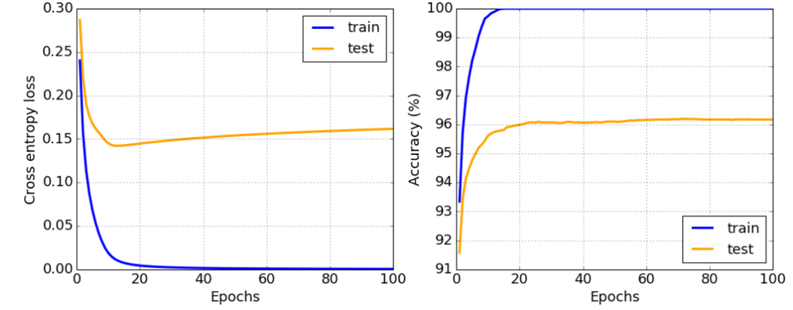

# 神经网络框架

正如我们已经学习到的，要能够高效地训练神经网络，我们需要做两件事：

* 操作张量，例如相乘、相加和计算一些函数如sigmoid或softmax
* 计算所有表达式的梯度，以便执行梯度下降优化

## [课前测验](https://red-field-0a6ddfd03.1.azurestaticapps.net/quiz/105)

尽管`numpy`库可以完成第一部分，但我们仍需要某种机制来计算梯度。在先前章节开发的[我们的框架](../04-OwnFramework/OwnFramework.ipynb)中，我们不得不在`backward`方法内手动编程所有的导数函数来进行反向传播。理想情况下，一个框架应让我们能够计算*任何表达式*的梯度。

另一个重要的事情是能够在GPU或任何其他专用计算单元（如[TPU](https://en.wikipedia.org/wiki/Tensor_Processing_Unit)）上执行计算。深度神经网络训练需要*大量*的计算，并且能够在GPU上并行这些计算是非常重要的。

> ✅ 术语'并行化'意味着将计算分配到多个设备上。

目前，最流行的两个神经网络框架是：[TensorFlow](http://TensorFlow.org)和[PyTorch](https://pytorch.org/)。两者都提供了一个低级API，在CPU和GPU上操作张量。在低级API之上，还有高级API，分别称为[Keras](https://keras.io/)和[PyTorch Lightning](https://pytorchlightning.ai/)。

低级API | [TensorFlow](http://TensorFlow.org) | [PyTorch](https://pytorch.org/)
---------|-------------------------------------|-------------------------------
高级API  | [Keras](https://keras.io/)         | [PyTorch Lightning](https://pytorchlightning.ai/)

**低级API**允许你构建所谓的**计算图**。此图定义了如何利用给定的输入参数计算输出（通常是损失函数），并且如果有GPU可用，可以将其推送到GPU上进行计算。还有一些函数用于求导这个计算图并计算梯度，这些梯度随后可用于优化模型参数。

**高级API**基本上将神经网络视为一个**层的序列**，使大多数神经网络的构建变得更容易。训练模型通常需要准备数据，然后调用`fit`函数来完成这项工作。

高级API允许你非常快速地构建典型的神经网络，而不必担心许多细节。同时，低级API提供了对训练过程更大的控制，因此在研究新神经网络架构时经常使用。

还需要理解的是，你可以共同使用两种API，例如，使用低级API开发自己的网络层架构，然后在用高级API构建和训练的大型网络中使用它。或者你可以使用高级API作为层的序列来定义网络，然后使用自己的低级训练循环来执行优化。两种API使用相同的基本概念，并且设计为能够很好地协作。

## 学习

在本课程中，我们提供了大部分内容同时适用于PyTorch和TensorFlow。您可以选择首选的框架，并仅学习相应的笔记本。如果您不确定选择哪个框架，可以阅读一些关于**PyTorch vs. TensorFlow**的讨论。您也可以查看这两个框架以获得更好的理解。

尽可能情况下，我们将使用高级API以求简单。然而，我们认为理解从基础到高级的神经网络工作原理非常重要，因此一开始我们将使用低级API和张量进行工作。然而，如果您希望快速入门并不想花太多时间学习这些细节，您可以跳过这些直接进入高级API笔记本。

## ✍️ 练习：框架

在以下笔记本中继续您的学习：

低级API | [TensorFlow+Keras 笔记本](IntroKerasTF.ipynb) | [PyTorch](IntroPyTorch.ipynb)
---------|-------------------------------------|------------------------------
高级API  | [Keras](IntroKeras.ipynb)          | *PyTorch Lightning*

在掌握框架之后，让我们回顾一下过拟合的概念。

# 过拟合

过拟合是机器学习中一个极其重要的概念，掌握它非常重要！

考虑以下近似5个点（在下图中由`x`表示）的问题：

 | 
-----------------------------|--------------------------
**线性模型，2个参数**       | **非线性模型，7个参数**
训练误差 = 5.3               | 训练误差 = 0
验证误差 = 5.1               | 验证误差 = 20

* 左边，我们看到一个很好的直线近似。因为参数数量是恰当的，模型正确理解了点的分布。
* 右边，模型太强大了。因为我们只有5个点，而模型有7个参数，它可以调整以通过所有点，使得训练误差为0。然而，这阻止了模型理解数据背后的正确模式，因此验证误差非常高。

在模型的复杂度（参数数量）和训练样本数量之间找到正确的平衡非常重要。

## 为什么会发生过拟合

  * 训练数据不足
  * 模型太强大
  * 输入数据中噪音过多

## 如何检测过拟合

正如上图所示，过拟合可以通过非常低的训练误差和高的验证误差来检测。通常在训练过程中，我们会看到训练误差和验证误差都在减少，然后某个时候验证误差可能停止减少并开始上升。这将是过拟合的信号，表明我们应该停止训练（或至少保存模型的快照）。

## 如何防止过拟合

如果你发现过拟合发生了，你可以采取以下措施之一：

 * 增加训练数据量
 * 减少模型的复杂度
 * 使用某种[正则化技术](../../4-ComputerVision/08-TransferLearning/TrainingTricks_chs.md)，例如[Dropout](../../4-ComputerVision/08-TransferLearning/TrainingTricks_chs.md#Dropout)，我们稍后会考虑这些技术。

## 过拟合和偏差-方差权衡

过拟合实际上是统计学中的一种更通用的问题，称为[偏差-方差权衡](https://en.wikipedia.org/wiki/Bias%E2%80%93variance_tradeoff)。如果我们考虑模型中可能的错误来源，我们可以看到两种类型的错误：

* **偏差错误**，由我们的算法未能正确捕捉训练数据之间的关系引起。它可能是由于我们的模型不够强大（**欠拟合**）造成的。
* **方差错误**，由模型近似输入数据中的噪声而不是有意义的关系引起（**过拟合**）。

在训练过程中，偏差错误减少（因为我们的模型学会近似数据），而方差错误增加。重要的是在发现过拟合时停止训练 - 无论是手动还是自动（通过引入正则化） - 以防止过拟合。

## 结论

在本课中，您了解了两个最流行的AI框架TensorFlow和PyTorch的不同API。此外，您还了解了一个非常重要的主题，过拟合。

## 🚀 挑战

在配套的笔记本中，您将在底部找到“任务”；请完成笔记本中的任务。

## [课后测验](https://red-field-0a6ddfd03.1.azurestaticapps.net/quiz/205)

## 复习与自学

对以下主题进行一些研究：

- TensorFlow
- PyTorch
- 过拟合

问自己以下问题：

- TensorFlow和PyTorch的区别是什么？
- 过拟合和欠拟合的区别是什么？

## [作业](lab/README_chs.md)

在本实验中，您需要使用PyTorch或TensorFlow解决两个分类问题，使用单层和多层完全连接的网络。

* [说明](lab/README_chs.md)
* [笔记本](lab/LabFrameworks.ipynb)