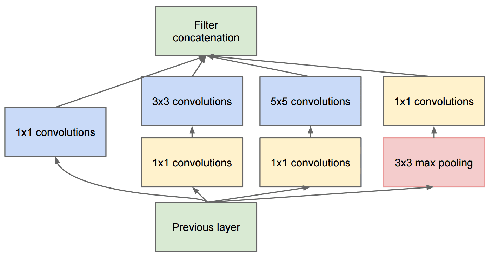

# 著名的 CNN 架构

### VGG-16

VGG-16 是一个在 2014 年 ImageNet top-5 分类中达到了 92.7% 准确率的网络。它的层结构如下：

如你所见，VGG 遵循传统的金字塔架构，这是一个卷积-池化层的序列。

> 图片来自 [Researchgate](https://www.researchgate.net/figure/Vgg16-model-structure-To-get-the-VGG-NIN-model-we-replace-the-2-nd-4-th-6-th-7-th_fig2_335194493)

### ResNet

ResNet 是微软研究院在 2015 年提出的一系列模型。ResNet 的主要思想是使用**残差块**：

> 图片来自 [这篇论文](https://arxiv.org/pdf/1512.03385.pdf)

使用恒等传递的原因是让我们的层预测前一层结果与残差块输出之间的**差异**，因此得名*残差块*。这些块更容易训练，可以构建包含数百个这种块的网络（最常见的变体有 ResNet-52, ResNet-101 和 ResNet-152）。

你还可以将这个网络想象为能够根据数据集调整其复杂性。最初，当你开始训练网络时，权重值较小，大部分信号通过透传的恒等层。随着训练的进行和权重变大，网络参数的重要性增加，网络也调整以适应所需的表达能力，从而正确分类训练图像。

### Google Inception

Google Inception 架构更进一步，将每个网络层构建为多个不同路径的组合：

> 图片来自 [Researchgate](https://www.researchgate.net/figure/Inception-module-with-dimension-reductions-left-and-schema-for-Inception-ResNet-v1_fig2_355547454)

在这里，我们需要强调 1x1 卷积的作用，因为乍看之下它们没有意义。为什么我们需要用 1x1 滤波器遍历图像？然而，你需要记住卷积滤波器还会与多个深度通道（最初是 RGB 颜色，在后续层是不同滤波器的通道）一起工作，而 1x1 卷积用来用不同的可训练权重将这些输入通道混合在一起。它也可以被视为在通道维度上的下采样（池化）。

这是 [一个关于这个主题的好博客](https://medium.com/analytics-vidhya/talented-mr-1x1-comprehensive-look-at-1x1-convolution-in-deep-learning-f6b355825578)，以及 [原始论文](https://arxiv.org/pdf/1312.4400.pdf)。

### MobileNet

MobileNet 是一系列减少体积的模型，适用于移动设备。如果资源有限并可以牺牲一些准确性，请使用它们。其主要思想是所谓的**深度可分离卷积**，这允许通过空间卷积和深度通道上的 1x1 卷积的组合表示卷积滤波器。这极大地减少了参数数量，使网络体积更小，并且也更容易用较少的数据进行训练。

这是 [一个关于 MobileNet 的好博客](https://medium.com/analytics-vidhya/image-classification-with-mobilenet-cc6fbb2cd470)。

## 结论

在这个单元中，你已经学习了计算机视觉神经网络 —— 卷积网络的主要概念。用于图像分类、目标检测，甚至图像生成网络的现实世界架构都基于 CNN，只是层数更多，还有一些额外的训练技巧。

## 🚀 挑战

在随附的笔记本中，底部有关于如何获得更高准确率的注释。做一些实验，看你是否能达到更高的准确率。

## [讲课后测验](https://red-field-0a6ddfd03.1.azurestaticapps.net/quiz/207)

## 复习与自学

虽然 CNN 最常用于计算机视觉任务，但它们通常适合提取固定大小的模式。例如，如果我们处理的是声音，我们可能也希望使用 CNN 来寻找音频信号中的某些特定模式 —— 在这种情况下滤波器将是一维的（这种 CNN 称为 1D-CNN）。此外，有时 3D-CNN 用于在多维空间中提取特征，例如在视频中发生某些事件 —— CNN 可以捕捉到随时间变化的特征模式。请复习和自学其他可以用 CNN 完成的任务。

## [作业](lab/README_chs.md)

在这个实验中，你的任务是分类不同的猫狗品种。这些图像比 MNIST 数据集更复杂且维度更高，并且类别超过 10 个。