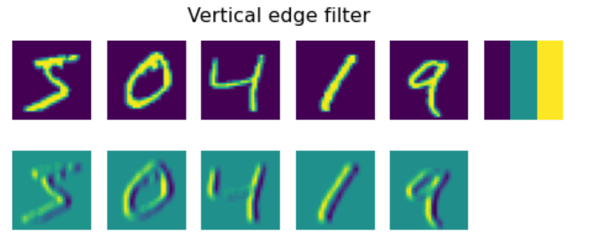
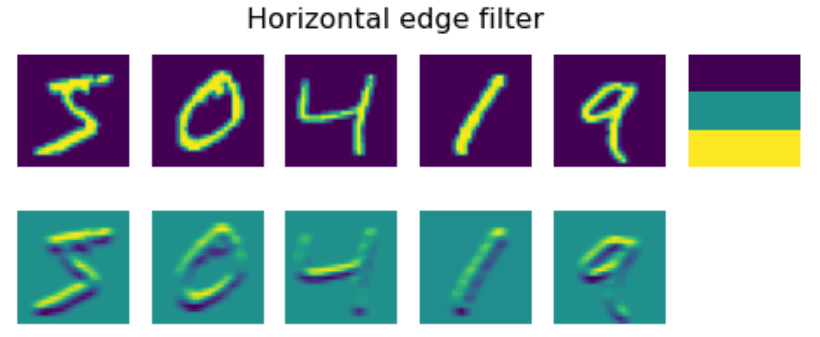
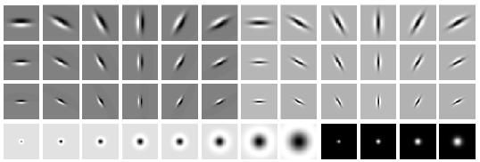
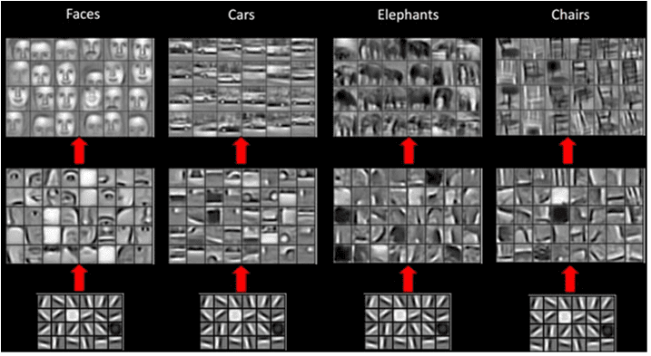
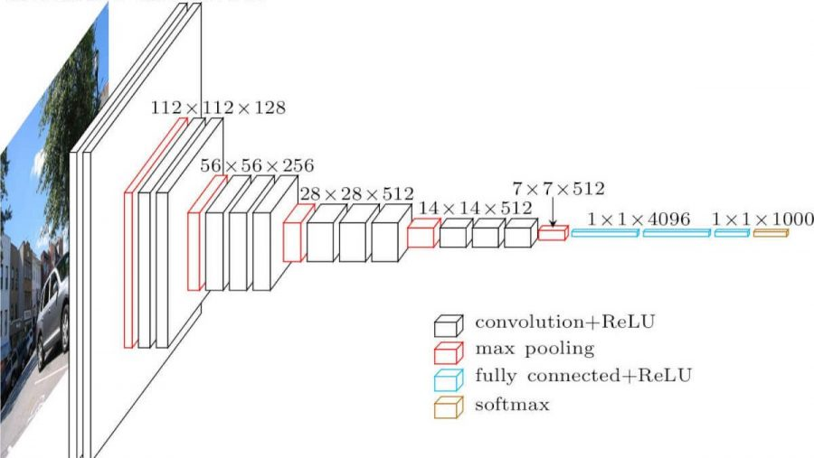

# 卷积神经网络

我们之前已经看到神经网络在处理图像方面相当不错，甚至单层感知器也能够以合理的准确率识别MNIST数据集中手写的数字。然而，MNIST数据集非常特殊，所有的数字都在图像中居中，这使得任务变得更简单。

## [课前测验](https://red-field-0a6ddfd03.1.azurestaticapps.net/quiz/107)

在现实生活中，我们希望能够识别图像中的物体，而不管它们在图像中的确切位置。计算机视觉不同于一般的分类，因为当我们试图在图像中找到某个特定物体时，我们是在扫描图像以寻找某些特定**模式**及其组合。例如，在寻找一只猫时，我们可能首先寻找水平线，这些线可以形成胡须，然后某种胡须的组合可以告诉我们这实际上是一张猫的照片。相对位置和某些模式的存在是重要的，而不是它们在图像中的确切位置。

为了提取模式，我们将使用**卷积滤波器**的概念。如您所知，图像由一个二维矩阵或一个带有颜色深度的三维张量表示。应用滤波器意味着我们取一个相对较小的**滤波器核**矩阵，对于原始图像中的每个像素，我们计算其与邻近点的加权平均值。我们可以将其视为一个在整个图像上滑动的小窗口，根据滤波器核矩阵中的权重对所有像素进行平均。

 | 
----|----

> 图片由 Dmitry Soshnikov 提供

例如，如果我们将3x3的纵向边缘和横向边缘滤波器应用于MNIST数字，我们可以在原始图像中存在纵向和横向边缘的位置获得高亮度（例如高值）。因此，这两个滤波器可以用来“查找”边缘。同样，我们可以设计不同的滤波器来查找其他低级模式：

> [Leung-Malik滤波器组](https://www.robots.ox.ac.uk/~vgg/research/texclass/filters.html)图像

然而，虽然我们可以手动设计滤波器以提取一些模式，但我们也可以设计网络，以便它自动学习这些模式。这是CNN背后的主要思想之一。

## CNN的主要思想

CNN的工作方式基于以下几个重要思想：

* 卷积滤波器可以提取模式
* 我们可以设计网络，使滤波器自动训练
* 我们可以使用相同的方法在高级特征中找到模式，而不仅仅是在原始图像中。因此，CNN特征提取在特征的层次结构上工作，从低级像素组合到更高级的图像部分组合。

> 图片来自 [Hislop-Lynch的论文](https://www.semanticscholar.org/paper/Computer-vision-based-pedestrian-trajectory-Hislop-Lynch/26e6f74853fc9bbb7487b06dc2cf095d36c9021d)，基于[他们的研究](https://dl.acm.org/doi/abs/10.1145/1553374.1553453)

## ✍️ 练习：卷积神经网络

让我们继续探索卷积神经网络的工作原理，以及如何通过练习相关笔记本实现可训练的滤波器：

* [卷积神经网络 - PyTorch](ConvNetsPyTorch.ipynb)
* [卷积神经网络 - TensorFlow](ConvNetsTF.ipynb)

## 金字塔架构

大多数用于图像处理的CNNs遵循所谓的金字塔架构。应用于原始图像的第一个卷积层通常具有相对较少的滤波器（8-16个），这些滤波器对应于不同的像素组合，例如水平/垂直线条。在下一个层次，我们减少了网络的空间维度，并增加了滤波器的数量，这对应于更多的简单特征组合。在每一层中，随着我们向最终分类器移动，图像的空间维度减少，而滤波器的数量增加。

例如，让我们看看VGG-16的架构，这是一个在2014年ImageNet的前五分类中达到了92.7%准确率的网络：

> 图片来自 [Researchgate](https://www.researchgate.net/figure/Vgg16-model-structure-To-get-the-VGG-NIN-model-we-replace-the-2-nd-4-th-6-th-7-th_fig2_335194493)

## 最著名的CNN架构

[继续学习最著名的CNN架构](CNN_Architectures.md)