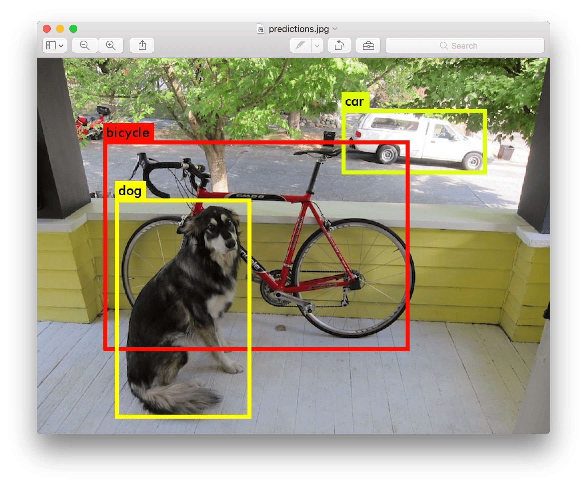
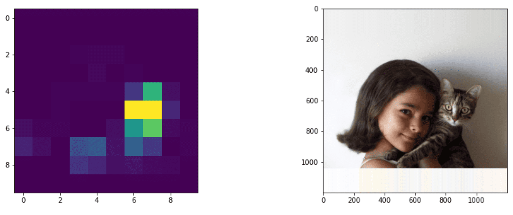
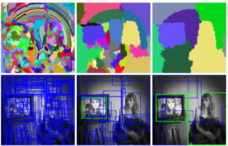
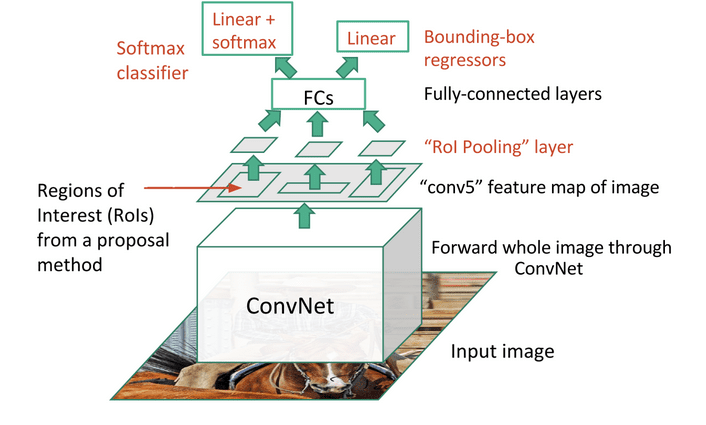
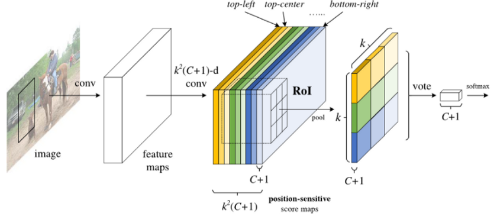
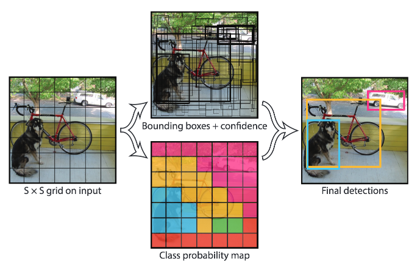

# 目标检测

到目前为止我们讨论的图像分类模型都是将图像输入并生成一个分类结果，比如在MNIST问题中的类别“数字”。然而，在许多情况下，我们不仅希望知道图片中有物体，还希望能够确定它们的精确位置。这正是**目标检测**的目的。

## [课前测验](https://red-field-0a6ddfd03.1.azurestaticapps.net/quiz/111)

> 图片来自 [YOLO v2 官网](https://pjreddie.com/darknet/yolov2/)

## 一个简单的目标检测方法

假设我们想在一张图片中找到一只猫，一个非常简单的目标检测方法是：

1. 将图片分解成若干小块
2. 在每个小块上运行图像分类
3. 对于那些获得足够高激活的小块，可以认为包含了我们要找的物体

> *图片来自 [实践笔记](ObjectDetection-TF.ipynb)*

然而，这种方法远非理想，因为它只能非常不精确地定位物体的边界框。为了更精确地定位，我们需要运行某种**回归**来预测边界框的坐标——为此，我们需要特定的数据集。

## 用回归进行目标检测

[这篇博客](https://towardsdatascience.com/object-detection-with-neural-networks-a4e2c46b4491)对检测形状进行了很好的入门介绍。

## 目标检测的数据集

你可能会遇到以下用于此任务的数据集：

* [PASCAL VOC](http://host.robots.ox.ac.uk/pascal/VOC/) - 20个类别
* [COCO](http://cocodataset.org/#home) - 常见物体在上下文中。80个类别，包括边界框和分割掩码

## 目标检测的度量标准

### 交并比（IoU）

图像分类很容易衡量算法的表现，而对于目标检测，我们不仅需要衡量类别的正确性，还需要衡量推断的边界框位置的精度。后者使用所谓的**交并比**（IoU），即衡量两个框（或任意两个区域）的重叠程度。

> *图2来自[这篇关于IoU的优秀博客文章](https://pyimagesearch.com/2016/11/07/intersection-over-union-iou-for-object-detection/)*

其思想很简单——我们将两个图形之间的交集面积除以它们的并集面积。对于两个相同的区域，IoU为1，而对于完全不相交的区域则为0。否则它会在0到1之间变化。我们通常仅考虑那些IoU超过某个值的边界框。

### 平均精度（AP）

假设我们想衡量某个给定类别$C$的物体识别得有多好。为此，我们使用**平均精度**指标，其计算方法如下：

1. 考虑显示检测阈值（从0到1）上精度的精度-召回率曲线
2. 根据阈值，我们将在图像中检测到更多或更少的物体，并得到不同的精度和召回率值。
3. 曲线将如下图所示：

> *图片来自[NeuroWorkshop](http://github.com/shwars/NeuroWorkshop)*

给定类别$C$的平均精度是该曲线下的面积。确切地说，召回轴通常分为10部分，并且在所有这些点上平均精度：

$$
AP = {1\over11}\sum_{i=0}^{10}\mbox{Precision}(\mbox{Recall}={i\over10})
$$

### AP 和 IoU

我们只考虑那些IoU超过某个值的检测。例如，在PASCAL VOC数据集中，通常假设$\mbox{IoU Threshold} = 0.5$，而在COCO中，AP是针对不同的$\mbox{IoU Threshold}$值测量的。

> *图片来自[NeuroWorkshop](http://github.com/shwars/NeuroWorkshop)*

### 平均平均精度 - mAP

目标检测的主要指标称为**平均平均精度**，或**mAP**。它是所有物体类别上的平均精度值，有时也包括$\mbox{IoU Threshold}$。更详细的计算**mAP**的过程在[本博客文章](https://medium.com/@timothycarlen/understanding-the-map-evaluation-metric-for-object-detection-a07fe6962cf3)中进行了描述，并且在[这里有代码示例](https://gist.github.com/tarlen5/008809c3decf19313de216b9208f3734)。

## 不同的目标检测方法

目标检测算法大致可以分为两大类：

* **区域提议网络**（R-CNN, Fast R-CNN, Faster R-CNN）。主要思想是生成**兴趣区域**（ROI）并在其上运行CNN，寻找最大激活。这有点类似于简单方法，区别在于ROIs以更巧妙的方式生成。这种方法的主要缺点之一是速度慢，因为我们需要对图片进行多次CNN分类器的传递。
* **一通道**（YOLO, SSD, RetinaNet）方法。在这些架构中，我们设计网络以在一次传递中预测类别和ROIs。

### R-CNN: 基于区域的CNN

[R-CNN](http://islab.ulsan.ac.kr/files/announcement/513/rcnn_pami.pdf)使用[选择性搜索](http://www.huppelen.nl/publications/selectiveSearchDraft.pdf)生成ROI区域的分层结构，然后通过CNN特征提取器和SVM分类器确定物体类别，并通过线性回归确定*边界框*坐标。[官方论文](https://arxiv.org/pdf/1506.01497v1.pdf)

> *图片来自van de Sande等，ICCV’11*

> *图片来自[这篇博客](https://towardsdatascience.com/r-cnn-fast-r-cnn-faster-r-cnn-yolo-object-detection-algorithms-36d53571365e)*

### F-RCNN - 快速R-CNN

这种方法类似于R-CNN，但区域是在卷积层之后定义的。

> 图片来自[官方论文](https://www.cv-foundation.org/openaccess/content_iccv_2015/papers/Girshick_Fast_R-CNN_ICCV_2015_paper.pdf)，[arXiv](https://arxiv.org/pdf/1504.08083.pdf)，2015

### 更快的R-CNN

这种方法的主要思想是使用神经网络预测ROIs——即所谓的*区域提议网络*。[论文](https://arxiv.org/pdf/1506.01497.pdf)，2016

> 图片来自[官方论文](https://arxiv.org/pdf/1506.01497.pdf)

### R-FCN: 基于区域的全卷积网络

该算法比Faster R-CNN更快。主要思想如下：

1. 我们使用ResNet-101提取特征
2. 特征由**位置敏感得分图**处理。每个$C$类别的对象分为$k\times k$区域，我们训练预测对象的部分。
3. 在$k\times k$区域的每个部分，所有网络为对象类别投票，选择最高票数的对象类别。

> 图片来自[官方论文](https://arxiv.org/abs/1605.06409)

### YOLO - 你只看一次

YOLO是一种实时的一通道算法。主要思想如下：

 * 将图像分为$S\times S$区域
 * 对每个区域，**CNN**预测$n$个可能对象，*边界框*坐标和*置信度*=*概率* * IoU。

 

> 图片来自[官方论文](https://arxiv.org/abs/1506.02640)

### 其他算法

* RetinaNet: [官方论文](https://arxiv.org/abs/1708.02002)
   - [Torchvision中的PyTorch实现](https://pytorch.org/vision/stable/_modules/torchvision/models/detection/retinanet.html)
   - [Keras实现](https://github.com/fizyr/keras-retinanet)
   - [Keras样例中的RetinaNet目标检测](https://keras.io/examples/vision/retinanet/)
* SSD (单次检测器): [官方论文](https://arxiv.org/abs/1512.02325)

## ✍️ 练习：目标检测

继续在以下笔记本中学习：

[ObjectDetection.ipynb](ObjectDetection.ipynb)

## 结论

在本课中，你快速浏览了各种完成目标检测的方法！

## 🚀 挑战

阅读这些关于YOLO的文章和笔记本，并尝试一下：

* [好的博客文章](https://www.analyticsvidhya.com/blog/2018/12/practical-guide-object-detection-yolo-framewor-python/)描述YOLO
 * [官方站点](https://pjreddie.com/darknet/yolo/)
 * Yolo: [Keras实现](https://github.com/experiencor/keras-yolo2)，[一步一步的笔记本](https://github.com/experiencor/basic-yolo-keras/blob/master/Yolo%20Step-by-Step.ipynb)
 * Yolo v2: [Keras实现](https://github.com/experiencor/keras-yolo2)，[一步一步的笔记本](https://github.com/experiencor/keras-yolo2/blob/master/Yolo%20Step-by-Step.ipynb)

## [课后测验](https://red-field-0a6ddfd03.1.azurestaticapps.net/quiz/211)

## 复习与自学

* [目标检测](https://tjmachinelearning.com/lectures/1718/obj/) 作者是Nikhil Sardana
* [目标检测算法的一个好的比较](https://lilianweng.github.io/lil-log/2018/12/27/object-detection-part-4.html)
* [深度学习算法目标检测回顾](https://medium.com/comet-app/review-of-deep-learning-algorithms-for-object-detection-c1f3d437b852)
* [基础目标检测算法的逐步介绍](https://www.analyticsvidhya.com/blog/2018/10/a-step-by-step-introduction-to-the-basic-object-detection-algorithms-part-1/)
* [在Python中实现Faster R-CNN进行目标检测](https://www.analyticsvidhya.com/blog/2018/11/implementation-faster-r-cnn-python-object-detection/)

## [作业：目标检测](lab/README_chs.md)