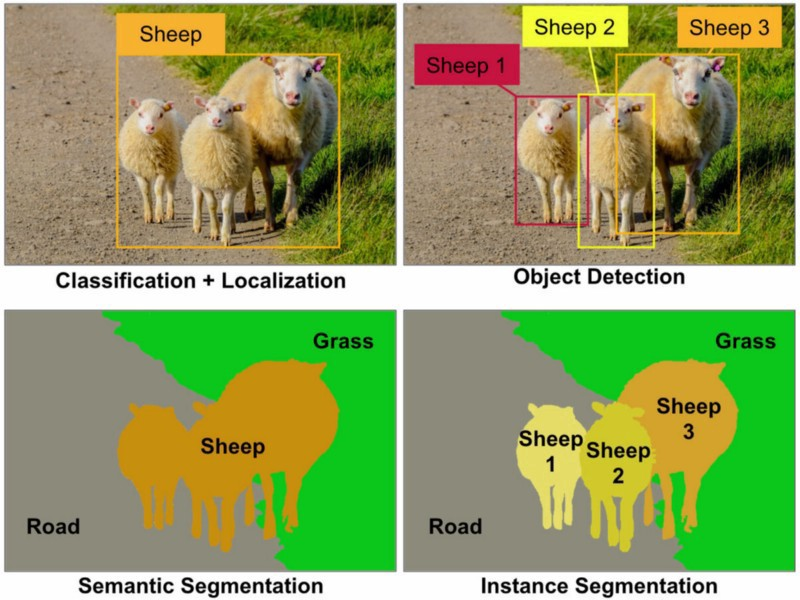
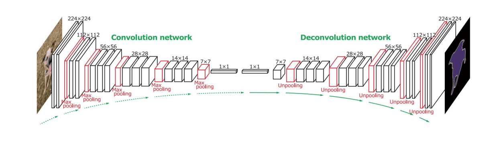
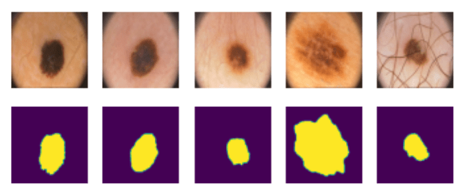

# 分割

我们之前学习了物体检测，它允许我们通过预测其*边界框*来定位图像中的物体。然而，对于某些任务，我们不仅需要边界框，还需要更精确的物体定位。这项任务被称为**分割**。

## [讲前测验](https://red-field-0a6ddfd03.1.azurestaticapps.net/quiz/112)

分割可以看作是**像素分类**，即对于图像的**每个**像素，我们必须预测其类别（*背景*是其中一个类别）。主要有两种分割算法：

* **语义分割** 只告诉像素的类别，不能区分同一类别的不同物体
* **实例分割** 将类别分成不同的实例。

对于实例分割，这些绵羊是不同的物体，但对于语义分割，所有绵羊都代表一个类别。

> 图片来自[这篇博客](https://nirmalamurali.medium.com/image-classification-vs-semantic-segmentation-vs-instance-segmentation-625c33a08d50)

有多种神经结构用于分割，但它们都具有相同的结构。在某种程度上，它类似于你之前学习过的自动编码器，但我们的目标不是解构原始图像，而是解构**掩码**。因此，分割网络具有以下部分：

* **编码器** 从输入图像中提取特征
* **解码器** 将这些特征转换为具有相同大小和相应类别数量的**掩码图像**。

> 图片来自[这篇出版物](https://arxiv.org/pdf/2001.05566.pdf)

我们尤其要提到用于分割的损失函数。在使用经典自动编码器时，我们需要测量两幅图像之间的相似性，并可以使用均方误差(MSE)来做到这一点。在分割中，目标掩码图像中的每个像素表示类号（沿第三维度单热编码），因此我们需要使用特定于分类的损失函数 - 平均于所有像素的交叉熵损失。如果掩码是二进制的，则使用 **二元交叉熵损失**（BCE）。

> ✅ 单热编码是一种将类别标签编码成长度等于类别数的向量的方法。参见[本文](https://datagy.io/sklearn-one-hot-encode/)了解这种技术。

## 医学图像分割

在这节课中，我们将通过训练网络识别医学图像中的人类痣（也称为痣）来看到分割的实际应用。我们将使用来自<a href="https://www.fc.up.pt/addi/ph2%20database.html">PH2数据库</a>的皮肤镜图像作为图像来源。该数据集包含典型痣、不典型痣和黑色素瘤的200张图像。所有图像还包含一个对应的**掩码**， outlining 痣。

> ✅ 这种技术特别适合这种类型的医学成像，但你还可以想象它有哪些其他的实际应用？

> 图片来自 PH2 数据库

我们将训练一个模型来将痣从其背景中分割出来。

## ✍️ 练习：语义分割

打开下面的笔记本，以了解更多关于不同的语义分割架构，练习使用它们，并观看它们的实际效果。

* [Semantic Segmentation Pytorch](SemanticSegmentationPytorch.ipynb)
* [Semantic Segmentation TensorFlow](SemanticSegmentationTF.ipynb)

## [课后测验](https://red-field-0a6ddfd03.1.azurestaticapps.net/quiz/212)

## 结论

分割是一种非常强大的图像分类技术，超越了边界框，实现到像素级别的分类。它在医学成像等应用中的应用非常广泛。

## 🚀 挑战

人体分割只是我们可以使用人物图像进行的常见任务之一。另一个重要的任务包括**骨架检测**和**姿态检测**。试试[OpenPose](https://github.com/CMU-Perceptual-Computing-Lab/openpose)库，看看姿态检测如何使用。

## 复习与自学

这篇[维基百科文章](https://wikipedia.org/wiki/Image_segmentation)对这种技术的各种应用提供了很好的概述。自己更多地了解一下实例分割和全景分割的细分领域。

## [作业](lab/README.md)

在这个实验中，尝试使用 Kaggle 上的[Segmentation Full Body MADS 数据集](https://www.kaggle.com/datasets/tapakah68/segmentation-full-body-mads-dataset)进行**人体分割**。