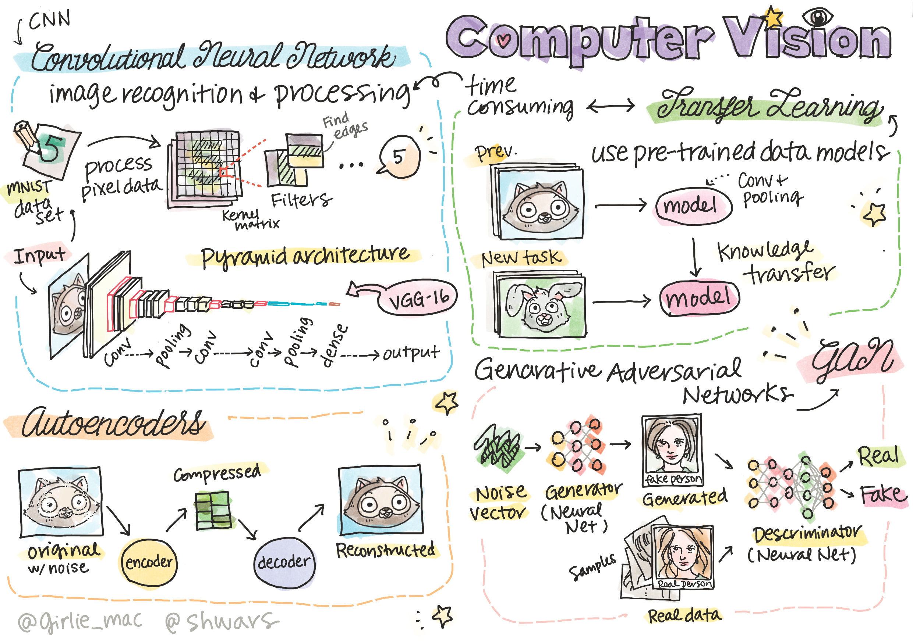

# Computer Vision

In this section we will learn about:

* [Intro to Computer Vision and OpenCV](06-IntroCV/README_chs.md)
* [Convolutional Neural Networks](07-ConvNets/README_chs.md)
* [Pre-trained Networks and Transfer Learning](08-TransferLearning/README_chs.md) 
* [Autoencoders](09-Autoencoders/README_chs.md)
* [Generative Adversarial Networks](10-GANs/README_chs.md)
* [Object Detection](11-ObjectDetection/README_chs.md)
* [Semantic Segmentation](12-Segmentation/README_chs.md)