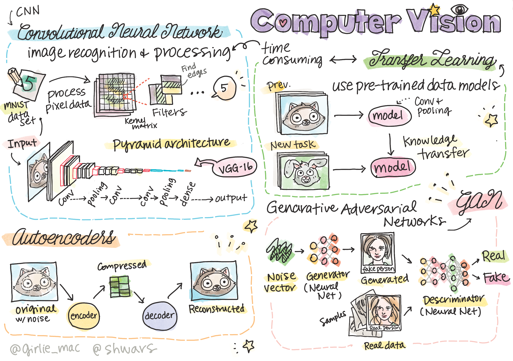

# 计算机视觉

在本节中我们将学习：

* [计算机视觉和OpenCV入门](06-IntroCV/README.md)
* [卷积神经网络](07-ConvNets/README.md)
* [预训练网络和迁移学习](08-TransferLearning/README.md)
* [自编码器](09-Autoencoders/README.md)
* [生成对抗网络](10-GANs/README.md)
* [物体检测](11-ObjectDetection/README.md)
* [语义分割](12-Segmentation/README.md)