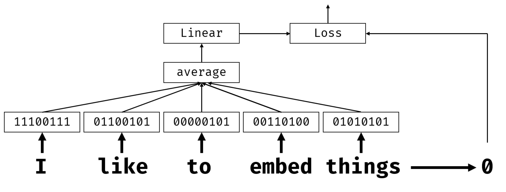
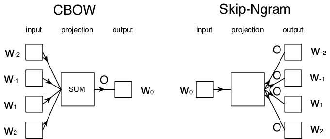

# 嵌入

## [课前测验](https://red-field-0a6ddfd03.1.azurestaticapps.net/quiz/114)

在基于BoW或TF/IDF训练分类器时，我们处理的是长度为`vocab_size`的高维词袋向量，并且我们明确地从低维位置表示向量转换为稀疏的独热表示。然而，这种独热表示并不高效。此外，每个词之间都是独立处理的，即独热编码向量不体现任何词语之间的语义相似性。

**嵌入**的想法是通过低维稠密向量来表示词语，从某种程度上反映词语的语义含义。稍后我们将讨论如何构建有意义的词嵌入，但现在我们将嵌入视为降低词向量维度的一种方法。

因此，嵌入层会接受一个词作为输入，并生成一个指定`embedding_size`的输出向量。在某种意义上，它与`Linear`层非常相似，但它不是接受独热编码向量，而是可以接受词语编号作为输入，从而避免创建庞大的独热编码向量。

通过将嵌入层作为分类器网络的第一层，我们可以从词袋模型切换到**嵌入袋**模型，在其中我们首先将文本中的每个词转换为相应的嵌入，然后对所有这些嵌入计算一些聚合函数，例如`sum`、`average`或`max`。

> 图片作者

## ✍️ 练习：嵌入

在以下笔记本中继续学习：
* [使用PyTorch嵌入](EmbeddingsPyTorch.ipynb)
* [使用TensorFlow嵌入](EmbeddingsTF.ipynb)

## 语义嵌入：Word2Vec

虽然嵌入层学习将词语映射到向量表示，但这种表示不一定具有很强的语义意义。学习一个向量表示，使得相似词或同义词对应于在某种向量距离（如欧几里得距离）上彼此接近的向量是有益的。

为此，我们需要以特定方式在大规模文本集合上预训练嵌入模型。这种进行语义嵌入训练的方法之一称为[Word2Vec](https://en.wikipedia.org/wiki/Word2vec)。它基于两种主要架构来生成词语的分布式表示：

- **连续词袋**（CBoW）——在这种架构中，我们训练模型从周围的上下文中预测一个词。给定ngram $(W_{-2},W_{-1},W_0,W_1,W_2)$，模型的目标是从$(W_{-2},W_{-1},W_1,W_2)$预测$W_0$。
- **连续跳字模型**与CBoW相反，模型使用上下文词的窗口来预测当前词。

CBoW更快，而跳字模型较慢，但在表示不常见词语时效果更好。

> 图片来源于[这篇论文](https://arxiv.org/pdf/1301.3781.pdf)

预训练的Word2Vec嵌入（以及其他类似模型，如GloVe）也可以在神经网络中替代嵌入层使用。然而，我们需要处理词汇表问题，因为用于预训练Word2Vec/GloVe的词汇表可能与我们的文本语料库中的词汇表不同。请查看上述笔记本了解如何解决此问题。

## 上下文嵌入

传统的预训练嵌入表示（如Word2Vec）的一个关键限制是词义消歧问题。虽然预训练的嵌入可以在某种程度上捕捉词语在上下文中的意义，但词语的每种可能意义都被编码在同一个嵌入中。这可能会在下游模型中引起问题，因为许多词语（如单词“play”）根据使用的上下文具有不同的意义。

例如，词“play”在这两个不同句子中的意义截然不同：

- 我去剧院看了一场**戏剧**。
- 约翰想和朋友们**玩耍**。

上述预训练嵌入将词“play”的这两种意义表示为相同的嵌入。为了克服这一限制，我们需要基于**语言模型**构建嵌入，该模型在大规模文本语料库上进行训练，并且*知道*如何在不同上下文中组合词语。本教程不讨论上下文嵌入，但我们会在课程后续讨论语言模型时重温这一主题。

## 总结

在本课中，你了解了如何在TensorFlow和Pytorch中构建和使用嵌入层以更好地反映词语的语义意义。

## 🚀 挑战

Word2Vec已被用于一些有趣的应用，包括生成歌词和诗歌。请查阅[这篇文章](https://www.politetype.com/blog/word2vec-color-poems)，了解作者如何使用Word2Vec生成诗歌。还可以观看[Dan Shiffmann的视频](https://www.youtube.com/watch?v=LSS_bos_TPI&ab_channel=TheCodingTrain)，了解这种技术的不同解释。然后尝试将这些技术应用到你自己的文本语料库中，可能来自Kaggle。

## [课后测验](https://red-field-0a6ddfd03.1.azurestaticapps.net/quiz/214)

## 复习与自学

阅读这篇关于Word2Vec的论文：[在向量空间中高效估计词语表示](https://arxiv.org/pdf/1301.3781.pdf)

## [作业：笔记本](assignment_chs.md)