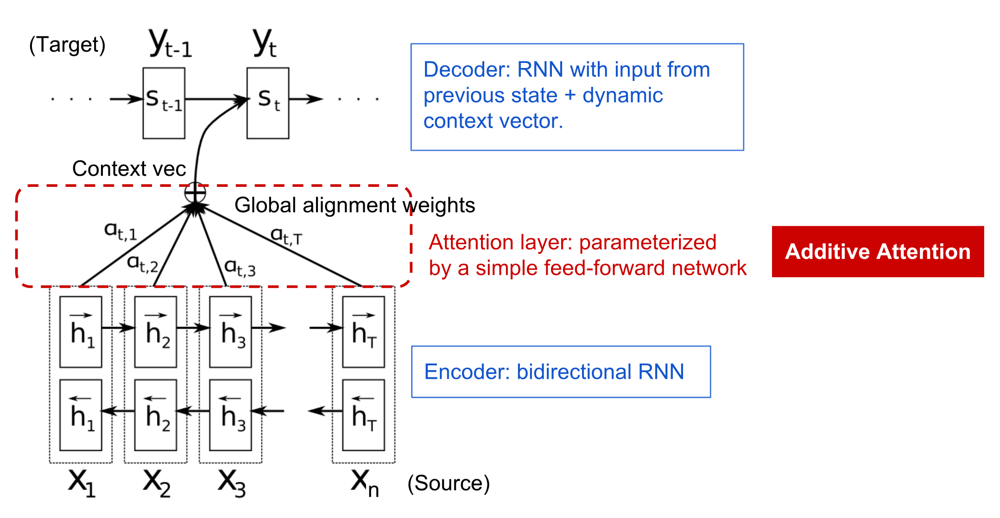
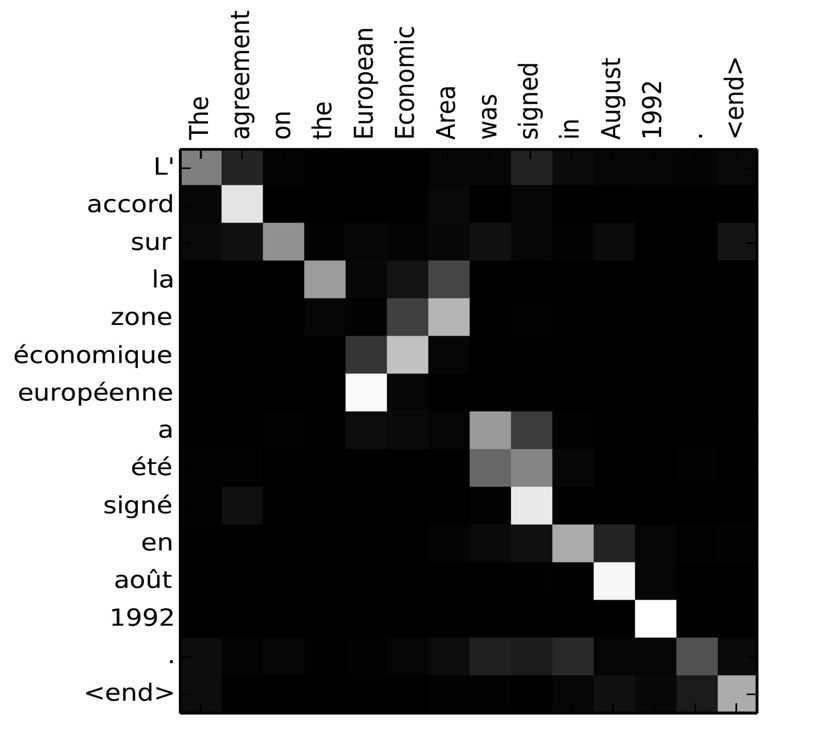
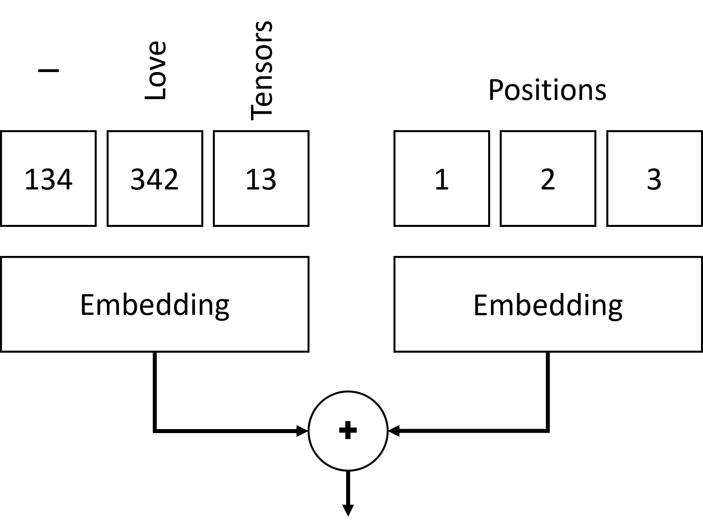
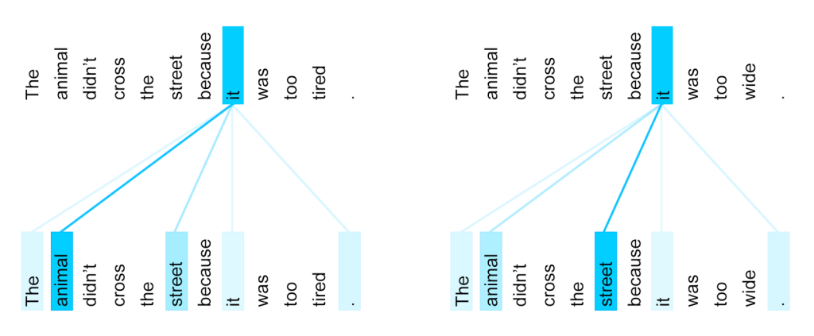

# 注意机制和Transformer

## [讲座前测验](https://red-field-0a6ddfd03.1.azurestaticapps.net/quiz/118)

自然语言处理领域中最重要的问题之一是**机器翻译**，这一任务是诸如谷歌翻译等工具的基础。在本节中，我们将重点关注机器翻译，或更广泛地说，任何*序列到序列*任务（也称为**句子转换**）。

在RNN中，序列到序列是由两个递归网络实现的，其中一个网络，即**编码器**，将输入序列压缩成一个隐藏状态，而另一个网络，即**解码器**，将这个隐藏状态展开成一个翻译结果。这种方法有几个问题：

* 编码器网络的最终状态难以记住句子的开头，从而导致长句子的模型质量较差
* 序列中的所有单词对结果的影响相同。然而，实际上，输入序列中的特定单词对顺序输出的影响往往比其他单词大。

**注意机制**提供了一种给每个输入向量对RNN每个输出预测的上下文影响进行加权的方法。其实现方式是通过在输入RNN和输出RNN的中间状态之间创建捷径。这样，在生成输出符号yt时，我们将考虑所有输入的隐藏状态hi，但有不同的权重系数&alpha;t,i。

> [Bahdanau et al., 2015](https://arxiv.org/pdf/1409.0473.pdf) 中的加性注意机制编码器-解码器模型，此图来自[这篇博客文章](https://lilianweng.github.io/lil-log/2018/06/24/attention-attention.html)

注意矩阵{&alpha;i,j}表示某些输入词在生成输出序列中特定词时的作用大小。下面是一个这样的矩阵示例：

> 图来自[Bahdanau et al., 2015](https://arxiv.org/pdf/1409.0473.pdf) (图3)

注意机制在当前或最近的自然语言处理技术中起到了至关重要的作用。但是，添加注意机制大大增加了模型参数的数量，这导致了RNN的扩展问题。扩展RNN的一个关键约束是模型的递归性质使得批处理和并行训练变得具有挑战性。在RNN中，每个序列元素需要按顺序处理，这意味着它不能轻易并行化。

> [谷歌博客](https://research.googleblog.com/2016/09/a-neural-network-for-machine.html)中的图

结合这种限制，注意机制的采用导致了我们今天所知并使用的最先进的Transformer模型的创建，包括BERT和Open-GPT3等。

## Transformer模型

Transformer背后的主要想法之一是避免RNN的顺序性质，并创建一个在训练期间可并行化的模型。这是通过实现两个想法来实现的：

* 位置编码
* 使用自注意机制来捕捉模式，而不是RNN（或CNN）（这就是介绍Transformer的论文被称为*[Attention is all you need](https://arxiv.org/abs/1706.03762)*的原因）

### 位置编码/嵌入

位置编码的想法如下。
1. 使用RNN时，标记的相对位置由步数表示，因此不需要显式表示。
2. 但是，一旦我们切换到注意机制，我们需要知道标记在序列中的相对位置。
3. 为了获得位置编码，我们将标记序列与标记在序列中的位置序列（即一系列数字0,1, ...）进行扩展。
4. 然后我们将标记位置与标记嵌入向量混合。为了将位置（整数）转换为向量，我们可以使用不同的方法：

* 可训练嵌入，类似于标记嵌入。这是我们考虑的方法。我们在标记和它们的位置上应用嵌入层，得到相同维度的嵌入向量，然后将它们加在一起。
* 固定位置编码函数，如原始论文所提议的。

> 作者提供的图片

通过位置嵌入，我们得到的结果既嵌入了原始标记，也嵌入了其在序列中的位置。

### 多头自注意

接下来，我们需要捕捉序列中的一些模式。为了做到这一点，Transformer使用了**自注意**机制，这本质上是将注意机制应用于相同的输入和输出序列。应用自注意机制使我们能够考虑句子中的**上下文**，并查看哪些词是相互关联的。例如，它允许我们查看哪些词是代词（如*它*）所指的，并且也考虑上下文：

> 图片来自[谷歌博客](https://research.googleblog.com/2017/08/transformer-novel-neural-network.html)

在Transformer中，我们使用**多头注意**，以使网络能够捕捉几种不同类型的依赖关系，例如长时与短时词关系，共指关系与其他等等。

[TensorFlow笔记本](TransformersTF.ipynb)包含关于Transformer层实现的更多详细信息。

### 编码器-解码器注意

在Transformer中，注意机制在两个地方使用：

* 使用自注意机制捕捉输入文本中的模式
* 执行序列翻译——这是编码器和解码器之间的注意层。

编码器-解码器注意非常类似于在本节开头描述的RNN中使用的注意机制。此动画图解释了编码器-解码器注意的作用。

由于每个输入位置独立地映射到每个输出位置，Transformer比RNN更能并行化，这使得更大且更具表现力的语言模型成为可能。每个注意头可以用来学习不同的单词关系，从而提高自然语言处理任务的效果。

## BERT

**BERT**（双向编码器表示的Transformer）是一个非常大的多层Transformer网络，*BERT-base*有12层，*BERT-large*有24层。该模型首先在大规模文本数据集（维基百科+书籍）上进行无监督训练（预测句子中的遮蔽词）。在预训练期间，模型吸收了大量的语言理解，这可以在其他数据集上通过微调进行充分利用。这个过程被称为**迁移学习**。

> 图片[来源](http://jalammar.github.io/illustrated-bert/)

## ✍️ 练习：Transformer

在以下笔记本中继续学习：

* [PyTorch中的Transformer](TransformersPyTorch.ipynb)
* [TensorFlow中的Transformer](TransformersTF.ipynb)

## 结论

在本课中，你了解了Transformer和注意机制，这些都是NLP工具箱中的基本工具。Transformer架构有很多变体，包括BERT、DistilBERT、BigBird、OpenGPT3等，可以进行微调。[HuggingFace包](https://github.com/huggingface/)提供了使用PyTorch和TensorFlow训练这些架构的资源库。

## 🚀 挑战

## [课后测验](https://red-field-0a6ddfd03.1.azurestaticapps.net/quiz/218)

## 复习和自学

* [博客文章](https://mchromiak.github.io/articles/2017/Sep/12/Transformer-Attention-is-all-you-need/)，解释经典的[Attention is all you need](https://arxiv.org/abs/1706.03762)论文，关于Transformer。
* [一系列博客文章](https://towardsdatascience.com/transformers-explained-visually-part-1-overview-of-functionality-95a6dd460452)，详细解释Transformer的架构。

## [作业](assignment.md)