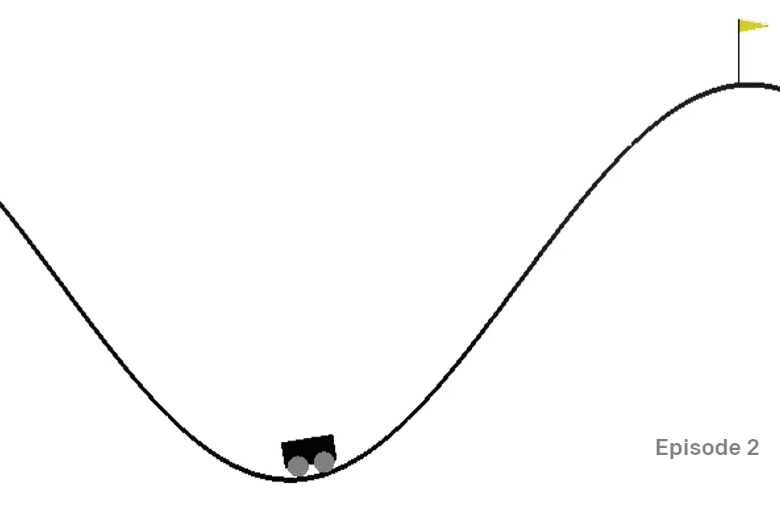

# 训练山地车逃脱

来自 [AI for Beginners Curriculum](https://github.com/microsoft/ai-for-beginners) 的实验任务。

## 任务

你的目标是在 OpenAI 环境中训练 RL 代理控制 [Mountain Car](https://www.gymlibrary.ml/environments/classic_control/mountain_car/)。

## 环境

山地车环境由陷在山谷中的汽车组成。你的目标是跳出山谷并到达旗子。你可以进行的操作是向左加速、向右加速或什么也不做。你可以观察汽车沿 x 轴的位置和速度。

## 初始笔记本

通过打开 [MountainCar.ipynb](MountainCar.ipynb) 开始实验。

## 收获

你应该在整个实验中学习到，将 RL 算法应用于新环境通常是相当直接的，因为 OpenAI Gym 对所有环境都有相同的接口，算法本身在很大程度上不依赖于环境的性质。你甚至可以重新构建 Python 代码，以便将任何环境作为参数传递给 RL 算法。