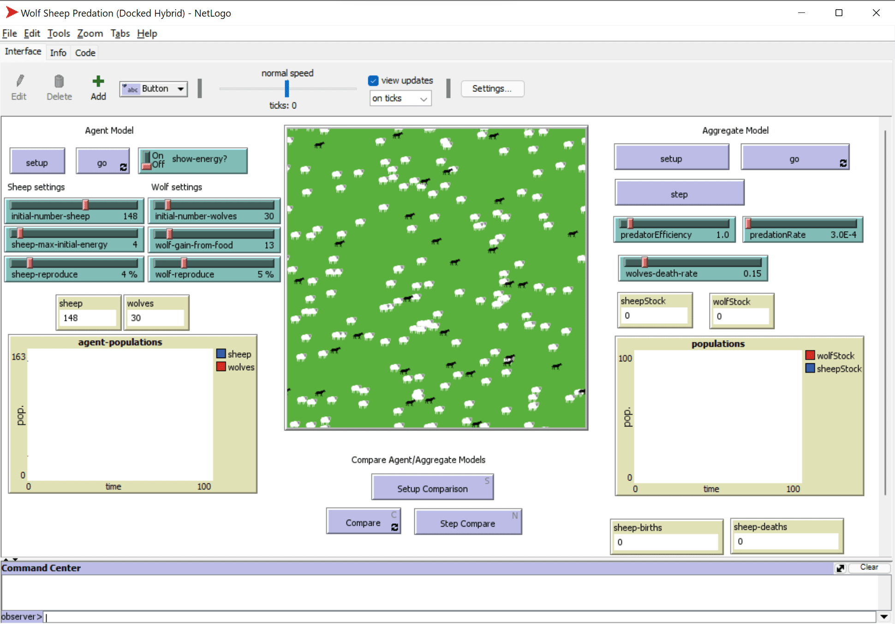

# 多智能体系统

实现智能的可能方式之一是所谓的**涌现**（或**协同**）方法，该方法基于这样一个事实：许多相对简单的智能体的组合行为可以导致整体系统更复杂（或更智能）的行为。从理论上讲，这基于[集体智慧](https://en.wikipedia.org/wiki/Collective_intelligence)、[涌现主义](https://en.wikipedia.org/wiki/Global_brain)和[进化控制论](https://en.wikipedia.org/wiki/Global_brain)的原则，这些原则表明，较高层次的系统通过适当地结合较低层次的系统（所谓的*元系统转换原则*）可以获得某种附加值。

## [课前测验](https://red-field-0a6ddfd03.1.azurestaticapps.net/quiz/123)
 
**多智能体系统**的方向在1990年代作为对互联网和分布式系统增长的回应在AI中出现。[人工智能：现代方法](https://en.wikipedia.org/wiki/Artificial_Intelligence:_A_Modern_Approach)是经典的AI教材之一，它从多智能体系统的角度聚焦经典AI。

多智能体方法的核心是**智能体**这一概念 - 一个生活在某种**环境**中的实体，它可以感知环境并对其进行操作。这是一个非常宽泛的定义，可能有很多不同类型和分类的智能体：

* 按其推理能力划分：
   - **反应型**智能体通常具有简单的请求-响应类型行为
   - **深思型**智能体采用某种逻辑推理和/或计划能力
* 按智能体执行其代码的地方划分：
   - **静态**智能体在一个专用的网络节点上工作
   - **移动**智能体可以在网络节点之间移动其代码
* 按其行为划分：
   - **被动智能体**没有特定目标。这些智能体可以对外部刺激作出反应，但不会主动采取行动。
   - **主动智能体**有一些他们追求的目标
   - **认知智能体**涉及复杂的计划和推理

多智能体系统现在用于许多应用中：

* 在游戏中，许多非玩家角色采用某种形式的AI，可以被视为智能体
* 在视频制作中，渲染涉及人群的复杂3D场景通常使用多智能体模拟完成
* 在系统建模中，多智能体方法用于模拟复杂模型的行为。例如，多智能体方法已成功用于预测全球COVID-19疾病的传播。类似的方法可以用于模拟城市交通，并观察其对交通规则变化的反应。
* 在复杂的自动化系统中，每个设备可以作为一个独立的智能体，使整个系统不那么单一，并更加健壮。

我们不会花很多时间深入研究多智能体系统，而是考虑一个**多智能体建模**的示例。

## NetLogo

[NetLogo](https://ccl.northwestern.edu/netlogo/) 是一个基于修改版[Logo](https://en.wikipedia.org/wiki/Logo_(programming_language))编程语言的多智能体建模环境。这种语言是为向孩子们教授编程概念而开发的，它允许你控制一个称为**乌龟**的智能体，它可以移动并留下痕迹。这使得创建复杂的几何图形成为可能，这是理解智能体行为的一种非常直观的方式。

在NetLogo中，我们可以使用 `create-turtles` 命令创建许多乌龟。然后我们可以命令所有乌龟做一些动作（在下面的例子中 - 前进10点）：

```
create-turtles 10
ask turtles [
  forward 10
]
```

当然，如果所有乌龟都做同样的事情就不有趣了，所以我们可以 `ask` 特定组的乌龟，比如那些在某一点附近的乌龟。我们也可以使用 `breed [cats cat]` 命令创建不同*种类*的乌龟。这里 `cat` 是种类的名字，我们需要指定单数和复数的词，因为不同的命令使用不同的形式以增强清晰度。

> ✅ 我们不会学习NetLogo语言本身 - 如果你有兴趣学习更多，可以访问出色的[初学者互动NetLogo词典](https://ccl.northwestern.edu/netlogo/bind/)资源。

你可以[下载](https://ccl.northwestern.edu/netlogo/download.shtml)并安装NetLogo进行尝试。

### 模型库

NetLogo的一个优点是它包含一个工作模型库，可以尝试。转到 **File &rightarrow; Models Library**，你可以选择许多类别的模型。


> Dmitry Soshnikov制作的模型库截图

你可以打开其中一个模型，例如 **Biology &rightarrow; Flocking**。

### 基本原理

打开模型后，会进入NetLogo的主屏幕。这里是描述狼和羊群体给定有限资源（草地）的示例模型。



> Dmitry Soshnikov制作的截图

在这个屏幕上，你可以看到：

* **界面**部分包含：
  - 存活所有智能体的主场地
  - 不同的控件：按钮、滑块等。
  - 可用于显示模拟参数的图表
* **代码**选项卡包含编辑器，可以在其中输入NetLogo程序

在大多数情况下，界面上会有一个**设置**按钮，用于初始化模拟状态，还有一个**启动**按钮，用于开始执行。这些由代码中相应的处理程序处理，通常如下所示：

```
to go [
...
]
```

NetLogo的世界由以下对象组成：

* **智能体**（乌龟）可以在场地上移动并做一些事情。可以使用 `ask turtles [...]` 语法命令智能体，括号中的代码由所有智能体在*乌龟模式*下执行。
* **补丁（Patches）**是智能体生活的场地上的方形区域。可以引用同一个补丁上的所有智能体，也可以更改补丁颜色和其他一些属性。你也可以 `ask patches` 执行某些操作。
* **观察者**是控制世界的唯一智能体。所有按钮处理程序都在*观察者模式*下执行。

> ✅ 多智能体环境的美妙之处在于，运行在乌龟模式或补丁模式下的代码由所有智能体并行执行。因此，通过编写少量代码并编程单个智能体的行为，你可以创建整体系统的复杂行为。

### 群体行为

作为多智能体行为的一例，让我们考虑 **[群体行为](https://en.wikipedia.org/wiki/Flocking_(behavior))**。群体行为是一种复杂的模式，非常类似于鸟群的飞行。当你观察它们飞行时，可能会认为它们遵循某种集体算法，或者它们具备某种*集体智慧*。然而，这种复杂的行为源于每个单独的智能体（在这种情况下，一个*鸟类*）只观察它短距离之外的其他智能体，并遵循三个简单规则：

* **对齐** - 它朝向邻近智能体的平均方向
* **凝聚** - 它试图朝向邻近智能体的平均位置（*长范围吸引力*）
* **分离** - 当靠近其他鸟类时，它试图远离（*短范围排斥力*）

你可以运行群体行为示例并观察其行为。你还可以调整参数，例如*分离度*或*视野范围*，即每只鸟能看多远。注意，如果你将视野范围减少到0，所有鸟类都变得盲目，群体行为停止。如果你将分离度减少到0，所有鸟类聚集成一条直线。

> ✅ 切换到**代码**选项卡，看看群体行为的三个规则（对齐、凝聚和分离）是如何在代码中实现的。注意我们如何只引用视距内的智能体。

### 其他可观看的模型

还有一些有趣的模型可以试验：

* **Art &rightarrow; Fireworks** 显示了如何将烟花视为个别火流的集体行为
* **Social Science &rightarrow; Traffic Basic**和**Social Science &rightarrow; Traffic Grid** 显示了1D和2D网格中的城市交通模型，有或没有交通信号灯。模拟中的每辆车遵循以下规则：
   - 如果前面的空间是空的 - 加速（到某个最大速度）
   - 如果看到前面的障碍物 - 刹车（可以调整司机能看到的距离）
* **Social Science &rightarrow; Party** 显示了鸡尾酒会上人们聚在一起的心理和社交行为。你可以找到导致群体幸福感上升最快的参数组合。

从这些示例中可以看出，多智能体模拟可以是理解由遵循相同或相似逻辑的个体组成的复杂系统行为的一种方法。它还可以用于控制虚拟智能体，例如电脑游戏中的[NPC](https://en.wikipedia.org/wiki/NPC)，或者3D动画世界中的智能体。

## 深思型智能体

上述描述的智能体非常简单，使用某种算法对环境变化做出反应。因此，它们是**反应型智能体**。然而，有时候智能体可以推理和计划其行动，此时它们被称为**深思型**智能体。

一个典型的例子是个人助手智能体接收人的指令预定一个度假行程。假设互联网上有许多可以帮助它的智能体。然后，它应该联系其他智能体查看有哪些航班可用，不同日期的酒店价格，并尝试协商最佳价格。当度假计划完成并由主人确认后，它可以继续预定。

为了做到这一点，智能体需要**通信**。为了成功通信，它们需要：

* 一些交换知识的**标准语言**，例如[知识交换格式](https://en.wikipedia.org/wiki/Knowledge_Interchange_Format)（KIF）和[知识查询与操作语言](https://en.wikipedia.org/wiki/Knowledge_Query_and_Manipulation_Language)（KQML）。这些语言基于[言语行为理论](https://en.wikipedia.org/wiki/Speech_act)设计。
* 这些语言还应包含一些**谈判协议**，基于不同的**拍卖类型**。
* 使用的**共有本体**，以便它们引用相同的概念并了解其语义
* 一种发现不同智能体可以做什么的方法，也基于某种形式的本体

深思型智能体比反应型更复杂，因为它们不仅对环境变化做出反应，还应该能够*发起*行动。为深思型智能体提出的架构之一是所谓的信念-欲望-意图（BDI）智能体：

* **信念**形成了有关智能体环境的一组知识。它可以被构建为知识库或智能体可以应用于环境中特定情况的一组规则。
* **欲望**定义了智能体想做什么，也就是它的目标。例如，上述个人助手智能体的目标是预定一个旅行，而酒店智能体的目标是最大化利润。
* **意图**是智能体为实现其目标而计划的具体行动。行动通常会改变环境并引起与其他智能体的通信。

有一些可用于构建多智能体系统的平台，例如[JADE](https://jade.tilab.com/)。[这篇文章](https://arxiv.org/ftp/arxiv/papers/2007/2007.08961.pdf)包含了多智能体平台的综述，以及多智能体系统的简史及其不同的使用场景。

## 结论

多智能体系统可以采取非常不同的形式，并用于许多不同的应用中。
它们都倾向于专注于单个智能体的简单行为，通过**协同效应**实现整体系统的复杂行为。

## 🚀 挑战

将本课内容应用于现实世界，尝试概念化一个可以解决问题的多智能体系统。例如，多智能体系统需要做些什么来优化校车路线？它在面包店中如何工作？

## [课后测验](https://red-field-0a6ddfd03.1.azurestaticapps.net/quiz/223)

## 复习与自学

复习这种系统在工业中的使用。在制造业或视频游戏产业等领域中，了解多智能体系统可以如何用来解决独特问题。

## [NetLogo作业](assignment_chs.md)