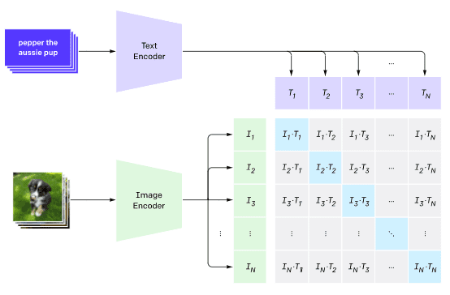
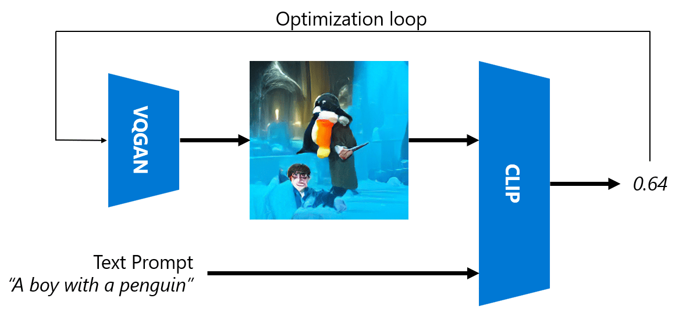
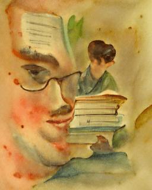
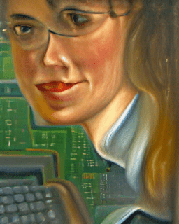
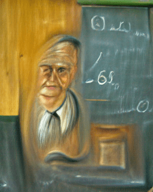

# 多模态网络

在transformer模型成功解决NLP任务之后，同样或相似的架构被应用于计算机视觉任务。现在越来越多的人对构建能够*结合*视觉和自然语言能力的模型感兴趣。OpenAI对此做了一些尝试，其中一个被称为CLIP和DALL.E。

## 对比图像预训练（CLIP）

CLIP的主要思想是能够比较文本提示和图像，并确定图像与提示的对应程度。

> *图片来自[这篇博客文章](https://openai.com/blog/clip/)*

该模型在从互联网上获取的图像及其标题上进行训练。对于每个批次，我们获取N对（图像，文本），并将它们转换为一些向量表示I1,..., IN / T1, ..., TN。然后将这些表示匹配在一起。损失函数被定义为最大化对应于一对（例如Ii和Ti）的向量之间的余弦相似度，并最小化所有其他对之间的余弦相似度。这就是这种方法被称为**对比**的原因。

CLIP模型/库可以从[OpenAI GitHub](https://github.com/openai/CLIP)获取。该方法在[这篇博客文章](https://openai.com/blog/clip/)中有所描述，并在[这篇论文](https://arxiv.org/pdf/2103.00020.pdf)中有更详细的描述。

一旦这个模型被预训练完成，我们可以给它一个图像批次和一个文本提示批次，它将返回一个包含概率的张量。CLIP可用于多个任务：

**图像分类**

假设我们需要在猫、狗和人类之间对图像进行分类。在这种情况下，我们可以给模型一个图像，和一系列的文本提示：“*一张猫的照片*”，“*一张狗的照片*”，“*一张人的照片*”。在结果的3个概率向量中，我们只需选择数值最高的索引。

> *图片来自[这篇博客文章](https://openai.com/blog/clip/)*

**基于文本的图像搜索**

我们也可以做相反的操作。如果我们有一个图像集合，我们可以将这个集合传递给模型，再加上一个文本提示——这将给我们与所给提示最相似的图像。

## ✍️ 示例： [使用CLIP进行图像分类和图像搜索](Clip.ipynb)

打开[Clip.ipynb](Clip.ipynb)笔记本，看看CLIP的实际应用。

## 使用VQGAN + CLIP进行图像生成

CLIP还可以用于从文本提示生成**图像**。为此，我们需要一个**生成器模型**，它能够根据一些向量输入生成图像。这样的模型之一称为[VQGAN](https://compvis.github.io/taming-transformers/)（矢量量化GAN）。

VQGAN区别于普通[GAG](../../4-ComputerVision/10-GANs/README_chs.md)的主要思想如下：
* 使用自回归transformer架构生成组成图像的情境丰富的视觉序列。这些视觉部分由[CNN](../../4-ComputerVision/07-ConvNets/README_chs.md)学习。
* 使用子图像判别器检测图像部分是“真实”还是“伪造”的（与传统GAN的“全或不全”方法不同）。

通过访问[Taming Transformers](https://compvis.github.io/taming-transformers/)网站了解更多关于VQGAN的信息。

VQGAN与传统GAN的一个重要区别是，后者可以从任何输入向量生成一张不错的图像，而VQGAN则可能生成不连贯的图像。因此，我们需要进一步指导图像创建过程，这可以通过CLIP来完成。

为了生成与文本提示相对应的图像，我们首先从一些随机编码向量开始，经过VQGAN生成图像。然后使用CLIP产生一个损失函数，显示图像与文本提示的对应程度。然后的目标是通过反向传播调整输入向量参数，以最小化该损失。

一个实现VQGAN+CLIP的极佳库是[Pixray](http://github.com/pixray/pixray)

 |   | 
----|----|----
根据提示*一张年轻男老师手持书本的近距离水彩肖像*生成的图片 | 根据提示*一张年轻女计算机科学老师手旁电脑的近距离油画肖像*生成的图片 | 根据提示*一张老年男数学老师站在黑板前的近距离油画肖像*生成的图片

> 图片来自[Dmitry Soshnikov](http://soshnikov.com)的**人工教师**系列

## DALL-E
### [DALL-E 1](https://openai.com/research/dall-e)
DALL-E是一个版本的GPT-3，用于从提示中生成图像。它经过了具有120亿参数的训练。

不同于CLIP，DALL-E同时接收文本和图像作为单一的令牌流。因此，在多个提示中，你可以根据文本生成图像。

### [DALL-E 2](https://openai.com/dall-e-2)
DALL.E 1和2之间的主要区别是，DALL-E 2生成的图像和艺术作品更加逼真。

使用DALL-E生成的图像示例：
 |   | 
----|----|----
根据提示*一张年轻男文学老师手持书本的近距离水彩肖像*生成的图片 | 根据提示*一张年轻女计算机科学老师手旁电脑的近距离油画肖像*生成的图片 | 根据提示*一张老年男数学老师站在黑板前的近距离油画肖像*生成的图片

## 参考文献

* VQGAN论文：[用于高分辨率图像合成的驯化transformer](https://compvis.github.io/taming-transformers/paper/paper.pdf)
* CLIP论文：[从自然语言监督中学习可转移的视觉模型](https://arxiv.org/pdf/2103.00020.pdf)